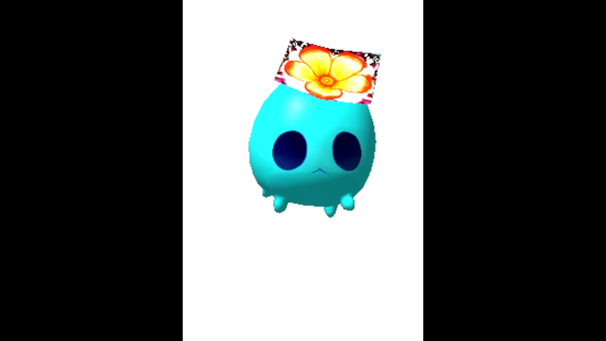

# DesktopPetWinUI3

这是一个 **Windows 11 / Visual Studio 2022 / C++/WinRT / WinUI 3 / D3D11** 的桌面宠物 MVP 源码包。



它包含：

- WinUI 3 控制中心窗口；
- 原生 Win32 透明置顶宠物渲染窗口；
- D3D11 简单宠物占位图形渲染；
- 基于时间的动画循环和挥手动作；
- Shell_NotifyIcon 托盘图标与右键菜单；
- 本地 JSON 配置读写；
- 本地 JSONL 记忆日志；
- TTS Provider 抽象与 Mock 实现；
- 动作 manifest 与示例 GLB 占位资源。

> 说明：我无法在当前 Linux 容器中实际运行 Visual Studio 编译测试。这个压缩包按 VS2022 + Windows App SDK C++/WinRT 项目结构生成，目标是可直接打开、还原 NuGet 包并构建。若 NuGet 版本不可还原，请在 `DesktopPet/packages.config` 中把 `Microsoft.WindowsAppSDK` 与 `Microsoft.Windows.CppWinRT` 更新到 Visual Studio 可用的稳定版本。

## 构建环境

建议环境：

- Windows 11 x64；
- Visual Studio 2022，安装 “使用 C++ 的桌面开发”；
- Visual Studio 2022，安装 Windows App SDK / WinUI 相关组件；
- Windows 10 SDK 或 Windows 11 SDK；
- NuGet 自动还原开启。

## 构建步骤

1. 解压本压缩包。
2. 双击打开 `DesktopPetWinUI3.sln`。
3. 选择 `x64` 和 `Debug`。
4. 在 Visual Studio 中执行 “还原 NuGet 包”。
5. 构建并部署项目。
6. 启动后会出现 WinUI 控制中心窗口，并创建一个置顶的原生宠物渲染窗口。

## 发布 Release

仓库已配置 GitHub Actions：推送 tag 时会自动构建 `Release|x64`，将 `bin\x64\Release` 打包为 zip，并发布到 GitHub Release。

打 tag 并推送：

```powershell
git tag v1.0.0
git push origin v1.0.0
```

如果需要覆盖已经推送过的 tag，先确认远端 Release 和 tag 是否要替换，再执行：

```powershell
git tag -d v1.0.0
git push origin :refs/tags/v1.0.0
git tag v1.0.0
git push origin v1.0.0
```

## 当前 MVP 行为

- 点击“显示宠物”会显示原生宠物窗口。
- 点击“隐藏宠物”会隐藏宠物窗口。
- 点击“挥手”会触发一段简单动画。
- 输入文本并点击“说话”会写入本地记忆日志并触发 Mock TTS。
- 托盘右键菜单支持显示、隐藏、挥手、打开控制中心和退出。
- 宠物窗口可以鼠标拖动。
- 背景使用演示级 color key 透明。生产版本建议替换为 DirectComposition per-pixel alpha 路径。

## 数据目录

运行后会在：

```text
%LOCALAPPDATA%\DesktopPetWinUI3\
```

保存：

```text
config.json
memory.jsonl
```

## 后续扩展建议

1. 将 `MockGltfLoader` 替换为 Microsoft glTF-SDK 或 tinygltf。
2. 将 `D3D11Renderer` 中的占位宠物顶点替换为真实 mesh upload。
3. 将 `AnimationController` 扩展为状态机、Blend Space、Montage、表情层与 viseme 层。
4. 将 `MockTtsProvider` 替换为 OpenAI TTS 或本地 GPT-SoVITS provider。
5. 将 `MemoryStore` 替换为 SQLite / FTS5 / 可选加密存储。
