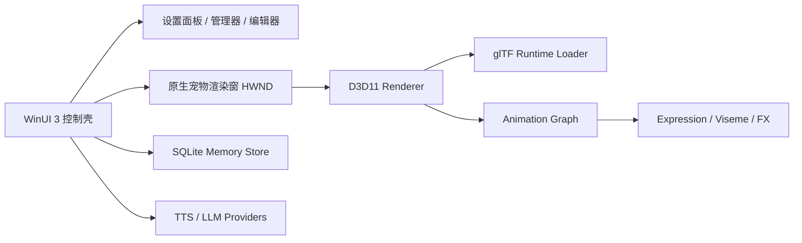
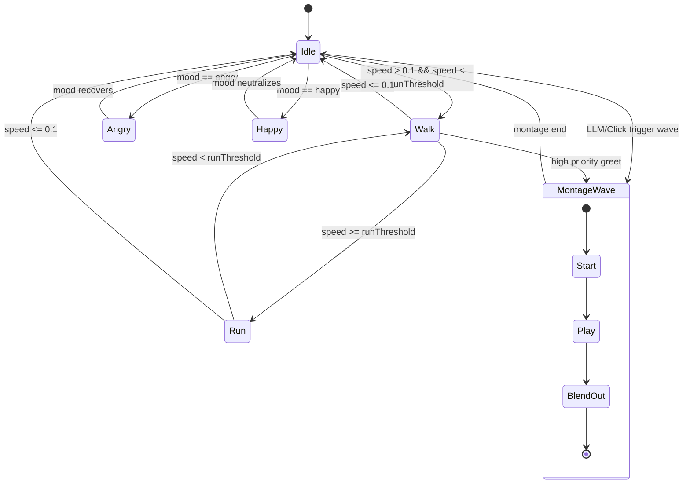
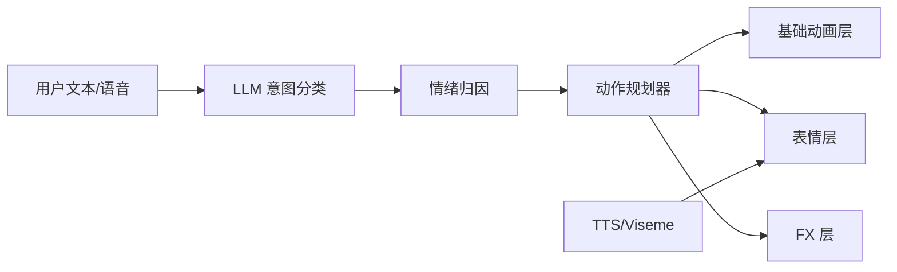
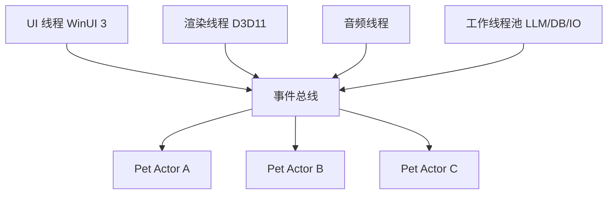
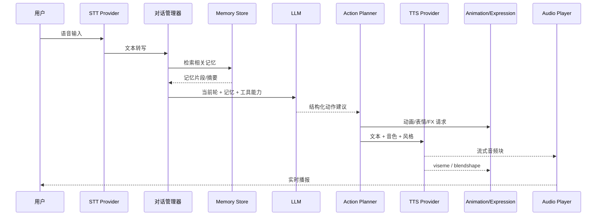
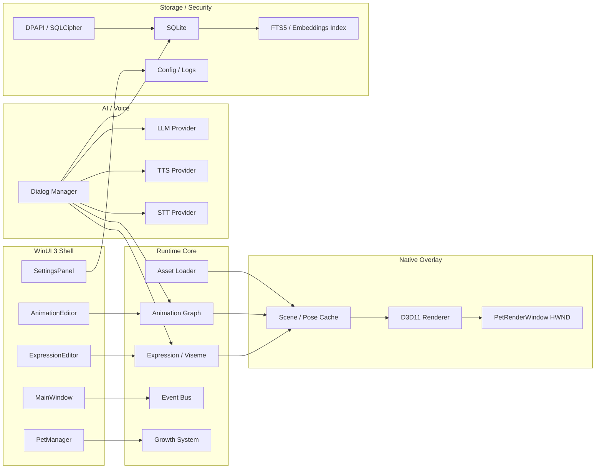
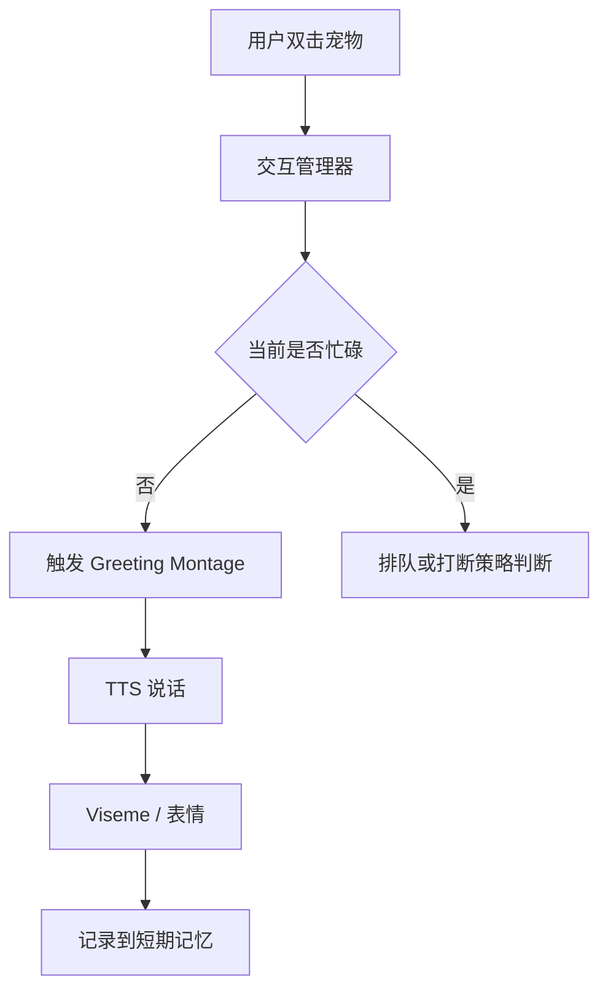

# Windows 纯原生 WinUI 3 桌面宠物应用技术分析报告

## 执行摘要

如果目标是“Windows 纯原生 WinUI 3 桌面宠物 + 透明桌面悬浮 + 3D 模型动画 + LLM 记忆 + 语音对话”，最稳妥的工程结论并不是把全部内容都做成一个 WinUI 3 窗口，而是采用**双层架构**：**WinUI 3 负责控制中心、设置面板、编辑器和管理界面；透明桌宠主窗口使用原生 Win32 + DXGI/D3D 渲染窗**。这样做的关键原因是，微软文档明确说明 **WinUI 3 的 `SwapChainPanel` 不支持 transparency**，也不能被 `AcrylicBrush` 或 `CompositionBackdropBrush` 采样，因此它不适合作为“透明悬浮宠物主窗”的最终宿主；而 `AppWindow` / `OverlappedPresenter` 更适合管理普通顶层工具窗口、设置置顶、边框、标题栏等行为。citeturn26view2turn13search0turn13search1turn27search0turn27search2

从 3D 资产格式看，**glTF 2.0 / GLB 应作为默认运行时格式**。Khronos 将 glTF 定义为面向高效传输和加载的免版税规范，它原生支持节点变换动画、皮肤蒙皮、morph targets，以及一个资产内包含多个动画条目；GLB 则把 JSON 与主二进制缓冲打包成单文件，便于部署。相较之下，FBX 功能强但格式与工具链更偏 Autodesk 生态；COLLADA/DAE 是开放标准但 XML 体量和解析成本更高；OBJ+MDD 和 MD5 更适合作为兼容旧资源或离线转换输入，而不宜作为新项目默认运行时格式。citeturn23search14turn14view0turn14view1turn14view2turn14view3turn24search0turn6search9turn18search8turn18search10turn6search2turn7search1turn7search11turn7search2turn7search3

从渲染与加载路径看，**Windows-only MVP 最推荐的组合是：原生 Win32 透明渲染窗 + D3D11 + glTF 运行时加载器 + WinUI 3 设置壳**。原因很直接：微软自己的 glTF-DXViewer 样例就是基于 DirectX 11 展示 glTF 特性；而 DirectXTK12 的 `Model` 运行时仍主要面向 `.CMO/.SDKMESH/.VBO`，并没有把 glTF 当成现成主路径，相关仓库 issue 中甚至能看到“为 Model 支持 glTF”的提议。D3D12 仍然适合长期演进，但对 MVP 来说，D3D11 在窗口互操作、调试复杂度和导入器接入方面更平衡。citeturn23search8turn36view0turn35search11turn35search13

动画系统不建议只做“播放单片段”；应从一开始就按**状态机 + Blend Space + Montage + 面部/表情层 + 特效层**来设计。Unreal 的状态机、Transition Rules、Blend Spaces、Animation Montage 和 Root Motion 文档给出了成熟拆法：基础 locomotion 层管理 idle / walk / run，montage 层负责 wave / greet / surprise 之类打断型动作，face layer 负责 morph target 或表情贴图，FX layer 负责粒子与屏幕特效。对于桌宠还必须额外加一层**屏幕空间根运动解析器**，决定“动画里的 root delta 是只做视觉摆动，还是要真正转成桌面坐标移动”。citeturn9search0turn9search2turn8search4turn9search18turn8search0turn8search19

记忆与语音层建议本地优先。短期记忆、长期画像和超长期事件摘要可以落在 SQLite；全文检索可直接用 FTS5；如果要数据库文件级加密，可选 SQLCipher；如果希望把密钥绑到当前 Windows 用户身份与本机环境，可用 DPAPI。在线语音方面，OpenAI TTS 文档明确支持实时流式音频，且建议 `wav` / `pcm` 作为最快响应格式；离线 / 本地语音可接 GPT-SoVITS，其官方仓库说明 Windows 10+ 可直接启动 WebUI，并支持 zero-shot 与 few-shot。嘴型同步如果要高质量落地，Azure Speech 的 viseme 输出是现成可用路径：它提供 viseme ID，也能输出 3D blend shapes JSON。citeturn11search1turn11search0turn11search2turn11search3turn10search0turn29view1turn29view0turn31view1turn31view2turn30view0turn30view1turn30view2

综合建议是：**先做“单宠物、本地状态机、GLB 运行时或 mock loader、SQLite 本地记忆、TTS 抽象接口”的 MVP；再上多动画组合、LLM 结构化动作规划、流式 TTS 与 viseme、多宠物互动、成长系统与插件化扩展。** 这样既能尽快验证桌宠体验，也能避免在第一个版本就被透明窗口、PBR、资产兼容、语音流与多实例调度同时拖垮。citeturn26view2turn23search14turn23search8turn11search1turn10search0turn31view1

## 范围、假设与需求

本报告基于如下工程假设：目标平台为 **Windows 10/11 x64**；面向普通消费级 PC；UI 框架以 **Windows App SDK / WinUI 3 + C++/WinRT** 为主；桌宠主画面要求透明悬浮、置顶、可拖拽；若后续用户要求“完整代码”，则优先交付一个**可运行的最小 MVP**，并把复杂度过高而不适合在一份报告中完整展开的部分拆成“可编译骨架 + 关键实现片段 + 可插拔接口”。Windows App SDK 官方说明 `AppWindow` 是顶层 `HWND` 的高级抽象，`OverlappedPresenter` 可管理置顶、边框、标题栏与 tool window 风格，但对真正透明桌宠主窗，仍需落回 Win32 / DXGI / DirectComposition 一层处理。citeturn13search0turn13search1

### 优先参考来源类别

本项目最应优先参考的来源类别，不是泛泛教程，而是以下顺序：

| 来源类别 | 适用内容 | 使用优先级 |
|---|---|---|
| Microsoft Learn、Khronos、Autodesk、SQLite、OpenAI、Azure 官方文档 | 平台能力、API、格式规范、授权边界 | 最高 |
| 官方 GitHub 仓库与官方示例 | 实际可用的工程结构、构建方式、样例代码 | 很高 |
| 原始规范、发布说明、官方 Wiki | 格式细节、兼容性、运行时能力说明 | 很高 |
| 中文官方文档与中文原仓库说明 | Windows / vcpkg / GPT-SoVITS 等中文落地资料 | 高 |
| 中文技术博客 | 填补工程细枝末节与踩坑经验 | 补充 |

上表是本报告的取材策略，而不是功能事实表；其依据是本题涉及的平台、格式、工具链都存在明确的官方规范与原始仓库，优先使用这些来源可以最大化降低误判。citeturn13search0turn23search14turn6search9turn11search1turn10search0turn30view0turn10search15

### 功能与需求清单

下表给出“必须支持”与“可选支持”的边界。这里的“必须”并不意味着首版全部做满，而是指**若要称得上这类产品的可交付 MVP / v1**，这些能力不能长期缺席。

| 分类 | 必须支持 | 可选支持 |
|---|---|---|
| 桌宠显示 | 透明悬浮主窗、桌面置顶、拖拽移动、基础缩放、托盘入口 | 多显示器吸附、碰撞边缘反弹、点击穿透热区 |
| 3D 资产 | GLB / glTF 运行时加载或 mock loader 替身、单模型实例化、基础材质 | FBX/DAE/OBJ+MDD/MD5 直接导入、离线资产烘焙工具 |
| 动画 | idle / walk / run / greeting 至少 4~6 个基础状态、状态机、过渡 | Blend Space、Montage、根运动、动作事件、IK、布料/二级骨骼 |
| 表情 | happy / angry / neutral 等基本表情；文本或情绪触发；嘴型同步接口 | 面部骨骼驱动、morph targets、贴图序列、粒子 FX、屏幕空间特效 |
| 交互 | 托盘菜单、设置面板、宠物管理面板、基础日志 | 动画编辑器、表情编辑器、行为脚本编辑器 |
| LLM | 结构化动作规划接口、短期记忆、长期画像、权限控制 | 超长期事件摘要、云同步、多模型路由、RAG 混合检索 |
| 语音 | TTS 抽象层、本地/在线双 Provider 接口、流式播放管线 | STT、本地离线语音唤醒、跨语言 voice cloning |
| 存储与安全 | SQLite、本地配置持久化、敏感数据加密或密钥保护 | SQLCipher、云端加密同步、插件签名检查 |
| 多宠物 | 单进程多实例、事件总线、状态隔离 | 宠物间关系网络、协作剧情、联机同步 |
| 成长系统 | 情绪、饥饿、经验与好感度 | 时间线剧情、任务系统、成就与收藏 |

必须项里最重要的两个硬约束是：**透明主窗不能依赖 WinUI 3 的 `SwapChainPanel`**，以及**托盘与窗口级行为必须回到 Win32 API**。微软文档对 `SwapChainPanel` 的透明限制写得很明确；而通知区域图标的官方路径依旧是 `Shell_NotifyIcon`。citeturn26view2turn12search0turn12search4turn12search12

### 面向桌宠场景的总体约束

桌宠不是普通 3D Viewer。它的难点几乎都来自“**长期驻留 + 多状态 + 透明叠加 + 输入/音频/LLM 并发**”，而不是单次加载一只模型。Windows App SDK 文档说明 `AppWindow` 可以管理顶层窗口的大小、位置和外观；`OverlappedPresenter` 可以指定始终置顶与 tool window 风格；但如果主画面需要 per-pixel alpha 与桌面混合，就必须考虑 `CreateSwapChainForComposition` / DirectComposition 或原生 layered window 等 Win32 技术。citeturn13search0turn13search1turn27search0turn12search1turn12search2

## 资产格式与原生渲染加载方案

### 支持的 3D 模型与动画文件格式

| 格式 | 授权/生态 | 骨骼动画 | 蒙皮 | Morph Targets | 多动画片段 | 文件大小与加载性能影响 | 主要优点 | 主要缺点 | 适合本项目程度 |
|---|---|---:|---:|---:|---:|---|---|---|---|
| glTF / GLB | Khronos 免版税开放规范；生态成熟 | 是 | 是 | 是 | 是 | glTF 以高效传输/加载为设计目标；GLB 单文件部署友好；Data URI 的 base64 会增加体积 | 运行时友好、PBR 生态完整、跨工具/跨引擎兼容好 | 运行时行为（自动播放、循环、片段编排）规范不定义，需你自己实现 | **首选默认格式** |
| FBX | Autodesk 格式；FBX SDK 免费但生态偏专有 | 是 | 是 | 是 | 常见工作流支持多 take/stack | 二进制版通常比文本友好，但导入器实现和兼容差异大；运行时直读成本偏高 | DCC 工具链强、绑定/蒙皮/形变能力强 | 授权与兼容性不如 glTF 简洁；运行时直读成本高 | 适合作离线输入与转换源 |
| COLLADA / DAE | Khronos / ISO 17506 开放标准 | 是 | 是 | 是 | 是 | XML 文本通常更冗长，解析与部署开销大于 GLB | 标准公开、可描述 skin / morph / animation clip | 体积与解析成本较高；现代实时运行时生态弱于 glTF | 兼容旧资源时可保留 |
| OBJ + MTL | 历史通用文本格式 | 否 | 否 | 否 | 否 | 文本简单，但材料、贴图、多文件管理麻烦 | 几何交换最稳、兼容面广 | 不带骨骼/蒙皮/动画 | 仅适合静态网格 |
| OBJ + MDD | OBJ 几何 + 点缓存生态 | 否 | 否 | 以顶点缓存方式实现 | 可拆为多个缓存文件 | 体积随“顶点数 × 帧数”快速膨胀；加载时有明显 I/O 和内存压力 | 可承载复杂烘焙形变 | 只能做顶点缓存式动画；同点数约束强 | 仅作特效/烘焙兼容 |
| MD5 mesh / anim | Doom 3 历史格式；格式公开但偏古老 | 是 | 是 | 否 | 多以独立 `.md5anim` 文件表示 | 结构较直白，老格式负担小，但现代材质/PBR 不足 | 骨骼动画分离清楚，适合学习或旧资源兼容 | 过时、面部与 PBR 表达弱 | 不建议作为新项目标准 |
| DirectXTK `.CMO/.SDKMESH/.VBO` | 微软工具链运行时格式 | 有限 | 可 | 视格式与导出链而定 | 取决于内容管线 | 官方明确是未压缩运行时格式，磁盘占用可与内存接近 | 对 DirectXTK 集成简单 | **不是通用 DCC 交换格式**，不适合外部美术资产主格式 | 仅适合内部样例或转换后资产 |

表中 glTF / FBX / COLLADA / OBJ / MDD / MD5 / DirectXTK 行的能力判断，分别依据 Khronos glTF 2.0 规范与官方 GitHub、Autodesk FBX SDK 文档、Khronos/ISO COLLADA 资料、LOC 对 OBJ 的格式描述、LightWave 对 MDD 点缓存工具的说明、Doom 3 的 MD5 文档，以及 DirectXTK / DirectXMesh 的官方 Wiki 整理；“文件大小与加载性能影响”列中与 XML、base64、点缓存体积相关的结论属于基于规范特征的工程推断。citeturn23search14turn14view0turn14view1turn14view2turn14view3turn24search0turn6search9turn15search2turn15search5turn15search14turn18search8turn18search10turn17view0turn6search2turn7search1turn7search11turn7search2turn7search3turn36view0turn3search0turn37view0

对桌宠应用最重要的不是“格式名单越多越好”，而是**运行时标准格式尽量少，兼容导入格式尽量多**。也就是说，运行时层建议只把 **GLB / glTF 2.0** 当成一等公民；FBX / DAE / OBJ+MDD / MD5 最好都走**离线转换/烘焙**流程，再产出标准化 GLB 或内部二进制缓存。这样可以把授权、兼容、调试和版本回归压力集中在一条主资产线，而不是把所有历史格式都硬塞进在线运行时。citeturn23search14turn23search12turn32search1turn33search0

### 在 WinUI 3 / Win32 原生环境中可行的 3D 渲染与加载方案比较

| 方案 | 优点 | 缺点 | 实现复杂度 | 性能特征 | 示例项目/证据 | 推荐结论 |
|---|---|---|---|---|---|---|
| **原生 Win32 + D3D11 + glTF 运行时加载器** | 最平衡；窗口互操作简单；调试成熟；易接 WinUI 3 壳层 | 你需要自己搭动画图、材质和资源管理 | 中 | 对消费级 PC 足够；MVP 友好 | `glTF-DXViewer`、`glTF-SDK` | **MVP 首选** |
| **原生 Win32 + D3D12 + DirectXTK12 + DirectXMesh** | 长期扩展空间最大；可做更完整自研渲染器 | D3D12 管理负担更重；DirectXTK12 `Model` 并非面向 glTF | 高 | 上限高，但实现成本高 | DirectXTK12 Wiki、Model Viewer、DirectXMesh | 长期演进可选，不适合先手 MVP |
| **WinUI 3 + `SwapChainPanel` + D3D11/12 互操作** | 适合在 XAML 中嵌入预览、编辑器、工具面板 | 官方明确不支持 transparency；主 swap chain 受 UI 线程约束 | 中 | 单/少量 swap chain 可行；多 panel 同时更新会掉性能 | `SwapChainPanel` 文档 | **只适合预览器，不适合透明主宠物窗** |
| **Win2D** | 集成 WinUI/XAML 极方便；适合 2D 表情、贴图序列、UI 叠加 | 本质是 2D GPU API，不是 3D 主渲染路径 | 低 | 2D 场景轻量高效 | Win2D 官方文档与仓库 | 适合作表情/编辑器辅助手段 |
| **Windows ML / DirectML** | 可做本地 AI 推理加速 | 不是渲染方案；DirectML 已进入维护模式，Windows ML 是新主线之一 | 中 | 与硬件相关；适合本地推理 | Windows ML / DirectML 官方文档 | 只用于 AI，不用于绘制模型 |
| **Filament + gltfio** | 现成 PBR、现成 glTF 2.0 loader、动画支持完整 | 与 WinUI 3/Win32 窗口编排集成成本较高；引入大型引擎依赖 | 中高 | 画质与 PBR 路线优秀 | Filament 官方仓库 | 若画质/PBR 优先，可作为生产级替代 |
| **bgfx + Assimp** | 渲染后端可切 D3D11/12/Vulkan；多窗口示例现成；跨平台潜力大 | Windows-only 项目会承担额外抽象成本；动画系统仍需自建 | 中高 | 多后端灵活，但调栈更复杂 | bgfx 官方仓库与 examples、Assimp 官方仓库 | 只在未来跨平台明确时考虑 |
| **Assimp 仅作导入层 + 自研渲染器** | 40+ 格式导入统一；适合离线工具和兼容旧资源 | 运行时直接读全格式会非常重；授权/兼容面更复杂 | 中 | 离线导入好；在线主路径不够轻 | Assimp 官方站点与仓库 | **推荐离线使用，不推荐主运行时直读所有格式** |

上表的判断依据是：微软文档与仓库说明 DirectXTK12 是 DX12 辅助库，其 `Model` 类主要面向 `.CMO/.SDKMESH/.VBO`，且这些格式是未压缩运行时格式；DirectXMesh 的官方定位也更偏几何处理与工具链；`SwapChainPanel` 文档明确写明它不支持透明，并说明主 swap chain 在 UI 线程上、同时更新很多 swap chain 会导致性能下降；Win2D 官方文档则明确其定位是 GPU 加速的即时模式 2D；DirectML 文档说明 DirectML 处于维护模式，Windows 11 24H2+ 更建议使用 Windows ML；Filament 官方仓库声明 `gltfio` 是 glTF 2.0 loader，支持 transform / morph / skin / joint animation；bgfx 官方仓库列出 D3D11/D3D12/Vulkan 等后端，并提供多窗口 example；Assimp 官方说明支持 40+ 导入格式。citeturn36view0turn3search0turn37view0turn32search2turn32search6turn26view0turn26view1turn26view2turn4search2turn38search0turn5search2turn5search3turn5search7turn20view0turn20view1turn20view2turn20view3turn34view0turn21search0turn32search1turn33search0turn33search1

### 最终推荐的技术落地路线

最推荐的工程组合如下：



对“Windows 原生、桌宠、透明悬浮、普通消费级 PC”这个特定约束集，建议是：**UI 壳层用 WinUI 3；主宠物画面用原生 HWND；渲染后端先用 D3D11；资产默认 GLB；旧格式走 Assimp/FBX SDK/离线转换；后续如确实需要更重的 PBR 与 IBL，再切 Filament。** 这是兼顾可做成、可维护、可扩展的路线，而不是纯粹理论上最先进的路线。citeturn26view2turn23search8turn23search0turn20view1turn32search1

## 动画、表情与交互编排

### 动画系统设计原则

桌宠动画系统最容易犯的错，是把所有动作都做成“播某个 clips”。更合理的做法，是借鉴 Unreal 的拆法，把系统分成四层：**Locomotion 基础状态层、Gesture/Montage 打断层、Face/Expression 层、FX 层**。Unreal 文档说明状态机用于定义动画何时可播放、何时可切换；Transition Rules 负责条件切换；Blend Spaces 则根据多输入值在多个动作之间插值；Montage 用于把动画组合成可直接控制播放的资产；Root Motion 则把运动数据从动画中提出来驱动角色移动。把这一套移植到桌宠后，核心差异在于：桌宠的“移动世界”不是 3D 地图，而是**桌面屏幕坐标系**。citeturn9search0turn9search18turn9search2turn8search4turn8search0

因此建议把根运动拆成三种策略：其一，**纯视觉 root motion**，只让脚步和身体摆动更自然，不真正移动桌宠；其二，**屏幕位移 root motion**，把水平 root delta 映射成桌面像素位移，用于 walk / run；其三，**钳制 root motion**，当桌宠贴边、被用户拖住、或正在执行高优先级交互时，仅保留姿势变化而忽略位移。这一策略不是规范要求，而是桌宠场景下最实用的实现约束。其理论来源是 UE 对 root motion 的定义，但屏幕空间映射属于本报告的工程设计建议。citeturn8search0turn8search19

### 建议状态机



这张状态图对应的最小实现不是“一个 enum”，而是**有层与优先级的图**：基础层只处理 locomotion；上层 montage 可以打断基础层，但不能永久破坏基础层状态；Face 层又独立于两者。这样才能让桌宠同时实现“边走边开心”“说话时眨眼”“打招呼时覆盖上半身动作”等组合行为。UE 的 Montage 与 Blend 节点文档，为这种“基础动作 + 插槽式打断”的设计提供了直接参考。citeturn8search4turn8search13turn9search29turn8search10

### 建议数据结构

| 结构 | 关键字段 | 作用 |
|---|---|---|
| `AnimationClipDesc` | `id`, `file`, `clipName`, `loop`, `duration`, `rootMotionMode`, `tags` | 描述单个动画片段 |
| `BlendSpaceDef` | `axisX`, `axisY`, `samples[]` | 通过速度/方向等驱动插值 |
| `StateNode` | `name`, `layer`, `defaultClip`, `transitions[]` | 状态图的节点 |
| `TransitionRule` | `condition`, `blendInMs`, `blendOutMs`, `interruptible` | 状态间过渡 |
| `MontageDef` | `slots[]`, `sections[]`, `priority` | 打断型或剧情型动作 |
| `ExpressionTrack` | `morphWeights`, `faceBones`, `textureSlot`, `ttl` | 面部/表情层 |
| `VisemeFrame` | `timeMs`, `visemeId`, `blendShapes[55]` | 嘴型帧 |
| `ActionPlan` | `animationId`, `expressionId`, `ttsStyle`, `fxId`, `priority` | LLM 输出给运行时的结构化动作包 |

### 动画调度伪代码

```cpp
void AnimationController::Update(const Context& ctx, float dt)
{
    // 1. 更新基础 locomotion 轴
    locomotion.speed = ctx.petVelocity.Length();
    locomotion.mood  = ctx.emotionState;

    // 2. 处理高优先级 montage
    if (montageQueue.HasRequest())
    {
        auto req = montageQueue.Peek();
        if (CanInterrupt(currentBaseState, req.priority))
        {
            StartMontage(req);
            montageQueue.Pop();
        }
    }

    // 3. 基础状态机切换
    auto next = stateGraph.Evaluate(currentBaseState, ctx, dt);
    if (next != currentBaseState)
    {
        BlendToState(currentBaseState, next);
        currentBaseState = next;
    }

    // 4. 采样基础层
    Pose basePose = SampleBaseLayer(currentBaseState, locomotion, dt);

    // 5. 叠加 montage
    if (activeMontage)
    {
        Pose montagePose = SampleMontage(*activeMontage, dt);
        basePose = BlendBySlot(basePose, montagePose, activeMontage->slotMask);
    }

    // 6. 叠加表情 / morph / viseme
    ApplyExpressions(basePose, activeExpressionTrack, dt);
    ApplyViseme(basePose.faceBlendShapes, currentVisemeFrame, dt);

    // 7. 根运动解析
    auto rootDelta = ExtractRootMotion(basePose);
    desktopMotionResolver.Apply(rootDelta, ctx.desktopBounds);

    // 8. 输出到渲染器
    renderer.SubmitPose(basePose);
}
```

这里最关键的工程点有两个。第一，**运行时不要直接相信资产里的动画名能描述语义**；glTF 规范只定义 `animations` 的存储，并明确不规定运行时如何播放、循环或自动开始，因此必须自己做语义映射层。第二，面部表情与 viseme 应作为独立层叠加，而不是把 happy / angry / speak 全做成整身动画，否则动作组合会迅速失控。citeturn14view3turn14view1turn30view1turn30view2

### 将动画与表情能力暴露给 LLM 的 JSON Schema

下列 schema 不是为了给美术看，而是为了给 **LLM / Action Planner / Tool Calling** 看。目标是让模型做“可控建议”，而不是直接输出自由文本动画名。

```json
{
  "$schema": "https://json-schema.org/draft/2020-12/schema",
  "title": "DesktopPetActionCatalog",
  "type": "object",
  "properties": {
    "version": { "type": "string" },
    "actions": {
      "type": "array",
      "items": {
        "type": "object",
        "required": [
          "id",
          "kind",
          "displayName",
          "assetFile",
          "clipName",
          "priority",
          "interruptible",
          "loop",
          "triggers"
        ],
        "properties": {
          "id": { "type": "string" },
          "kind": {
            "type": "string",
            "enum": ["animation", "expression", "fx", "visemeProfile"]
          },
          "displayName": { "type": "string" },
          "assetFile": { "type": "string" },
          "clipName": { "type": "string" },
          "layer": {
            "type": "string",
            "enum": ["base", "montage", "face", "fx"]
          },
          "loop": { "type": "boolean" },
          "priority": { "type": "integer", "minimum": 0, "maximum": 100 },
          "interruptible": { "type": "boolean" },
          "rootMotionMode": {
            "type": "string",
            "enum": ["none", "visual_only", "desktop_translate"]
          },
          "llmAliases": {
            "type": "array",
            "items": { "type": "string" }
          },
          "emotionTags": {
            "type": "array",
            "items": { "type": "string" }
          },
          "transition": {
            "type": "object",
            "properties": {
              "blendInMs": { "type": "integer" },
              "blendOutMs": { "type": "integer" }
            }
          },
          "triggers": {
            "type": "object",
            "properties": {
              "minSpeed": { "type": "number" },
              "maxSpeed": { "type": "number" },
              "requiredMood": { "type": "string" },
              "keywords": {
                "type": "array",
                "items": { "type": "string" }
              },
              "timeOfDay": {
                "type": "array",
                "items": { "type": "string" }
              }
            }
          }
        }
      }
    }
  },
  "required": ["version", "actions"]
}
```

### 五个示例条目

```json
{
  "version": "1.0.0",
  "actions": [
    {
      "id": "idle.base",
      "kind": "animation",
      "displayName": "待机",
      "assetFile": "pets/cat/cat_base.glb",
      "clipName": "Idle",
      "layer": "base",
      "loop": true,
      "priority": 10,
      "interruptible": true,
      "rootMotionMode": "none",
      "llmAliases": ["idle", "standby", "发呆", "待机"],
      "emotionTags": ["neutral"],
      "transition": { "blendInMs": 180, "blendOutMs": 180 },
      "triggers": { "minSpeed": 0.0, "maxSpeed": 0.1 }
    },
    {
      "id": "walk.base",
      "kind": "animation",
      "displayName": "走路",
      "assetFile": "pets/cat/cat_locomotion.glb",
      "clipName": "Walk",
      "layer": "base",
      "loop": true,
      "priority": 20,
      "interruptible": true,
      "rootMotionMode": "desktop_translate",
      "llmAliases": ["walk", "move", "巡逻", "走一走"],
      "emotionTags": ["neutral", "curious"],
      "transition": { "blendInMs": 120, "blendOutMs": 100 },
      "triggers": { "minSpeed": 0.1, "maxSpeed": 1.5 }
    },
    {
      "id": "run.base",
      "kind": "animation",
      "displayName": "奔跑",
      "assetFile": "pets/cat/cat_locomotion.glb",
      "clipName": "Run",
      "layer": "base",
      "loop": true,
      "priority": 25,
      "interruptible": true,
      "rootMotionMode": "desktop_translate",
      "llmAliases": ["run", "rush", "快跑", "冲刺"],
      "emotionTags": ["excited", "panic"],
      "transition": { "blendInMs": 80, "blendOutMs": 80 },
      "triggers": { "minSpeed": 1.5, "maxSpeed": 10.0 }
    },
    {
      "id": "angry.face",
      "kind": "expression",
      "displayName": "生气表情",
      "assetFile": "pets/cat/cat_face.glb",
      "clipName": "AngryFace",
      "layer": "face",
      "loop": true,
      "priority": 60,
      "interruptible": true,
      "rootMotionMode": "none",
      "llmAliases": ["angry", "mad", "生气", "不高兴"],
      "emotionTags": ["angry"],
      "transition": { "blendInMs": 60, "blendOutMs": 120 },
      "triggers": { "requiredMood": "angry", "keywords": ["讨厌", "烦", "别闹"] }
    },
    {
      "id": "happy.face",
      "kind": "expression",
      "displayName": "开心表情",
      "assetFile": "pets/cat/cat_face.glb",
      "clipName": "HappySmile",
      "layer": "face",
      "loop": true,
      "priority": 50,
      "interruptible": true,
      "rootMotionMode": "none",
      "llmAliases": ["happy", "smile", "开心", "高兴"],
      "emotionTags": ["happy"],
      "transition": { "blendInMs": 80, "blendOutMs": 150 },
      "triggers": { "requiredMood": "happy", "keywords": ["真棒", "谢谢", "喜欢"] }
    }
  ]
}
```

这一层的意义在于：**LLM 不直接回答“播放 angry_03_final_v7”这种工程内部名**，而是先命中 `angry.face` 这种稳定语义 ID；运行时再通过 manifest 映射到 `assetFile + clipName + layer + priority`。这恰好符合 glTF 规范对“规范只定义存储、不定义运行时编排”的边界。citeturn14view3

### 表情与动效系统

对于桌宠，表情系统最好同时支持三条路径：**图像/贴图序列**、**骨骼/BlendShape 面部驱动**、**语音驱动 viseme**。其中 2D 贴图序列适合眨眼、emoji、汗滴、惊叹号、开心波纹等极低成本反馈；骨骼或 blend shape 适合 3D 面部；语音驱动嘴型则依赖 viseme。Azure Speech 文档说明 viseme 事件可输出 viseme ID，也可输出 SVG 或 3D blend shapes；3D blend shape JSON 以 60 FPS 帧矩阵表达，并提供 22 个 viseme ID 与典型口型映射。citeturn30view0turn30view1turn30view2

对于 glTF 面部命名，还要注意一个经常被忽视的细节：glTF 2.0 并没有标准化 morph target 的名字本体，但规范实现说明里提到，很多工具会用 `mesh.extras.targetNames` 保存 target 名称。因此实际工程里最好自己维护一张**表情映射表**，把 DCC 导出的 `Smile`, `Angry`, `Blink_L`, `Blink_R`, `AA`, `OH` 等名字统一映射到运行时标准 ID。citeturn14view1

### 表情与动效编辑器原型

#### 动画编排编辑器

```text
┌──────────────────────────────────────────────────────────────┐
│ 动画编排编辑器                                               │
├──────────────┬───────────────────────────────────────────────┤
│ 动作列表      │  预览窗                                       │
│ Idle         │  [ 3D 宠物实时预览 ]                           │
│ Walk         │                                               │
│ Run          │  当前状态: Walk                                │
│ Wave         │  速度轴: 0.72                                  │
│ Sit          │                                               │
├──────────────┴───────────────────────────────────────────────┤
│ 过渡规则:  Idle -> Walk  [speed > 0.1]  blend=120ms          │
│            Walk -> Run   [speed > 1.5]  blend=80ms           │
└──────────────────────────────────────────────────────────────┘
```

#### 表情映射编辑器

```text
┌──────────────────────────────────────────────────────────────┐
│ 表情映射编辑器                                               │
├──────────────────────┬───────────────────────────────────────┤
│ 语义ID               │  绑定资源                              │
│ happy.face           │  cat_face.glb :: HappySmile           │
│ angry.face           │  cat_face.glb :: AngryFace            │
│ blink.left           │  cat_face.glb :: Blink_L              │
│ blink.right          │  cat_face.glb :: Blink_R              │
│ mouth.aa             │  cat_face.glb :: Viseme_AA            │
├──────────────────────┴───────────────────────────────────────┤
│ Preview Weight: [====0.65====]  Auto normalize: [x]          │
└──────────────────────────────────────────────────────────────┘
```

#### 嘴型与语音对齐编辑器

```text
┌──────────────────────────────────────────────────────────────┐
│ Viseme / 口型映射                                            │
├───────────────┬──────────────────────────────────────────────┤
│ Viseme ID 21  │  p / b / m                                   │
│ Viseme ID 18  │  f / v                                       │
│ Viseme ID 15  │  s / z                                       │
│ Viseme ID  0  │  silence                                     │
├───────────────┴──────────────────────────────────────────────┤
│ 时间线: 0ms----200----400----600----800----1000              │
│ 口型 : [0][21][18][15][0]                                    │
└──────────────────────────────────────────────────────────────┘
```

### 表情触发交互流程



## 记忆、多宠物与语音系统

### LLM 与记忆系统设计

建议把记忆分成三层，而不是把所有聊天记录混在一张表里。

| 记忆层 | 定义 | 保存周期 | 推荐存储 |
|---|---|---|---|
| 短期记忆 | 最近若干轮对话、当前任务、最近交互上下文 | 分钟到小时 | SQLite 普通表 + 滑动窗口 |
| 长期记忆 | 用户偏好、称呼、禁忌、常用时间段、宠物关系状态 | 天到月 | SQLite 主表 + FTS5 检索索引 |
| 超长期记忆 | 每日/每周摘要、重要事件、成长节点 | 月到年 | SQLite 摘要表；可选云同步 |

SQLite 官方说明它是 **in-process、self-contained、serverless、zero-configuration** 的事务型数据库；FTS5 是它的全文检索扩展；如果要数据库文件级加密，可选 SQLCipher，它在 SQLite 基础上增加 256-bit AES 加密与派生、内存清理等安全特性；如果你不想修改数据库引擎，也可以用 Windows DPAPI 保护应用密钥、令牌和用户敏感配置。citeturn11search1turn11search0turn11search2turn11search3turn11search19

检索策略建议采用**结构化过滤 + 语义召回 + 摘要压缩**三段式。结构化过滤先按宠物 ID、时间范围、情绪、场景标签过滤；语义召回再基于 embeddings 做相似检索；最后把召回结果压成一段短摘要回灌给主对话模型。OpenAI 的 embeddings 文档把搜索、聚类、推荐和分类列为典型用例，官方 cookbook 也明确提到可以用 cosine similarity 做文本相似检索。citeturn10search1turn10search5turn10search13

在隐私层面，本地优先是正确默认值。推荐做法是：聊天原文、成长状态、语音转写默认只落本地；云端 LLM/TTS 只发送**当前轮必要文本**；用户显式开启同步后，才上传压缩摘要。涉及第三方在线语音时，还要明确告知用户哪些文本或音频会离开本机。对于自定义音色或声纹克隆，更应加入单独的授权提示，因为这类能力容易越过普通“语音播报”边界。OpenAI 官方对自定义音色就明确要求提供 consent recording。citeturn29view0turn29view1

### 多宠物与互动系统

多宠物不要做成“多进程 + 多 D3D 设备 + 多数据库连接”那种粗暴结构。更合理的是：**单进程、多宠物实例、共享 GPU 设备、共享资源缓存、逻辑上对象隔离**。bgfx 的多窗口 example 说明多窗口渲染是可行路径；而 `SwapChainPanel` 文档也提示，很多 swap chain 同时更新会让性能下降。因此，桌宠数量增加时，最先应该共享的是**设备、纹理、着色器、模型缓存**，不是多开引擎。citeturn21search0turn26view1

推荐线程模型如下：



每只宠物都应被视为一个 actor：有自己的状态、动画图实例、情绪、成长值、消息邮箱；但模型资源、纹理与骨架模板可以共享。宠物间互动规则则做成事件反应表，例如：A 宠物快乐且靠近 B 时，向总线发 `InvitePlay`；B 若当前不在高优先级 montage，则切换到 `RespondPlay`。成长系统建议至少落地四个标量：`exp`、`hunger`、`mood`、`bond`。它们不要直接驱动动画，而应先影响高层决策，再通过动作规划器决定状态机与表情层。这样系统可解释、可调参、可做 A/B 配置。这个设计是本报告的工程建议，不是某个单一官方框架的强制规定。citeturn9search0turn8search4

### TTS 与语音对话

在线流式 TTS 方面，OpenAI 的 TTS 文档说明 Speech API 支持基于 chunk transfer encoding 的实时流式音频，`wav` 与 `pcm` 是最快响应格式，`wav` 免解码开销、`pcm` 则是 24kHz 16-bit little-endian 原始采样。对于桌宠这类“边说边动嘴”的场景，这种流式返回非常适合做边到边播。citeturn29view1turn29view0turn29view2

本地 / 离线 TTS 方面，GPT-SoVITS 官方仓库说明 Windows 10+ 可直接运行整合包；项目支持 Zero-shot TTS（约 5 秒样本）和 Few-shot TTS（约 1 分钟微调数据），对“本地角色音色”路线很有吸引力。它的正确接入方式通常不是把 Python 嵌进主进程，而是把它包装成**本地 provider 进程**或 localhost 服务，由 C++ 主程序通过 HTTP / IPC 调用。citeturn31view1turn31view2

语音对话完整链路建议拆成三个接口：`ISTTProvider`、`ILLMProvider`、`ITTSProvider`。如果 TTS Provider 原生给 viseme 或 blend shape，就直接走高精度口型同步；如果不给，就退化为 phoneme/文本规则映射。Azure Speech 文档说明 viseme 事件可以直接提供 viseme ID，或提供 SVG / 3D blend shapes 动画数据，这是在线方案里精度最高、实现阻力最小的路径之一。citeturn30view0turn30view1turn30view2

### 语音对话时序图



## UI、架构与最小示例代码

### UI 设计与窗口策略

WinUI 3 最适合承担的是**控制中心**，而不是透明宠物主画布。官方文档明确写明 `SwapChainPanel` 不支持透明，也不能被 `CompositionBackdropBrush` 类效果采样；同时它要求主 swap chain 运行在 UI 线程上。相反，原生 Win32 层可以用 `SetWindowPos` 管理顶层 Z 顺序，用 `WS_EX_LAYERED` / `SetLayeredWindowAttributes` 做演示级透明，或者在生产版中走 DirectComposition `CreateSwapChainForComposition` 路线做更稳定的 per-pixel alpha。WinUI 3 则用 `AppWindow` / `OverlappedPresenter` 做设置、面板和编辑器，会更顺手。citeturn26view2turn26view1turn12search1turn12search2turn27search0turn27search2turn13search0turn13search1

### 总体架构图



### 界面草图示意

#### 桌面宠物悬浮主窗

```text
┌──────────────────────── Desktop ────────────────────────┐
│                                                        │
│                       ( • ω • )                        │
│                      /|  ___  |\                       │
│                     / | /   \ | \                      │
│                       /     \                          │
│                                                        │
│       [右键菜单] [拖拽移动] [滚轮缩放] [双击互动]        │
└────────────────────────────────────────────────────────┘
```

#### 右键托盘菜单与快捷动作

```text
┌──────────────────────────────┐
│ Desktop Pet                  │
├──────────────────────────────┤
│ 显示/隐藏宠物                 │
│ 打开控制中心                  │
│ 切换宠物                      │
│ 动作：挥手 / 坐下 / 巡逻       │
│ 语音：静音 / 说话             │
│ 退出                          │
└──────────────────────────────┘
```

#### 控制中心主页

```text
┌──────────────────────────────────────────────────────────────┐
│ 控制中心                                                      │
├──────────────┬───────────────────────────────────────────────┤
│ 导航         │ 当前宠物: 奶糖                                  │
│ - 总览       │ 心情: 开心   饥饿: 32%   经验: 245              │
│ - 宠物管理   │ 记忆模式: 本地优先   语音: OpenAI / 本地可切换   │
│ - 动画       │ [显示宠物] [始终置顶] [开机启动] [静音]          │
│ - 表情       │                                                │
│ - 记忆       │ 最近事件: 今天早上互动 3 次                     │
│ - 语音       │                                                │
└──────────────┴───────────────────────────────────────────────┘
```

#### 宠物管理面板

```text
┌──────────────────────────────────────────────────────────────┐
│ 宠物管理                                                      │
├──────────────────────────────────────────────────────────────┤
│ [奶糖]  在线  开心  Lv.4   窗口#1   模型: cat_base.glb        │
│ [阿灰]  在线  中性  Lv.2   窗口#2   模型: bird.glb            │
│ [小火]  休眠  困倦  Lv.1   窗口#3   模型: fox.glb             │
├──────────────────────────────────────────────────────────────┤
│ [新增] [删除] [复制配置] [导出角色包] [导入角色包]            │
└──────────────────────────────────────────────────────────────┘
```

#### 动画编辑器

```text
┌──────────────────────────────────────────────────────────────┐
│ 动画编辑器                                                    │
├───────────────┬──────────────────────────────────────────────┤
│ 状态树         │ 预览                                          │
│ Idle          │ [3D preview]                                  │
│ Walk          │ 当前 clip: Walk                               │
│ Run           │ speed=1.2                                     │
│ Wave          │ blend in=120ms                                │
│ Angry         │ root motion=desktop_translate                 │
├───────────────┴──────────────────────────────────────────────┤
│ 片段映射: walk.base -> cat_locomotion.glb::Walk              │
└──────────────────────────────────────────────────────────────┘
```

#### 表情与 Viseme 编辑器

```text
┌──────────────────────────────────────────────────────────────┐
│ 表情 / Viseme 编辑器                                          │
├──────────────────────────────────────────────────────────────┤
│ HappySmile  weight: 0.84   Blink_L 0.00   Blink_R 0.12       │
│ AngryFace   weight: 0.00   Mouth_AA 0.20  Mouth_OH 0.05      │
│                                                              │
│ 口型时间线: [0][1][5][15][21][0]                             │
│                                                              │
│ [从 Azure viseme 导入] [从 phoneme 映射生成]                  │
└──────────────────────────────────────────────────────────────┘
```

#### 记忆与隐私面板

```text
┌──────────────────────────────────────────────────────────────┐
│ 记忆与隐私                                                    │
├──────────────────────────────────────────────────────────────┤
│ 存储位置: C:\Users\<user>\AppData\Local\DesktopPet\          │
│ 数据库: memory.db   加密: DPAPI key-wrap / SQLCipher 可选     │
│                                                              │
│ [x] 本地保存短期记忆                                          │
│ [x] 本地保存长期画像                                          │
│ [ ] 云同步摘要                                                │
│ [ ] 上传语音到在线服务                                        │
│ [清空本地记忆] [导出我的数据] [撤销音色授权]                  │
└──────────────────────────────────────────────────────────────┘
```

### 关键交互流程



### 最小可交付示例代码方案

这里不直接给出一个几百上千行的完整工程文本，而给出**可编译的最小项目骨架设计**。原因是：WinUI 3 C++/WinRT 项目的 `.vcxproj`、应用清单、打包配置与模板代码篇幅很大，完整展开会严重稀释核心实现。微软官方样例仓库已经提供了 Windows App SDK C++ Sample 模板，因此更实用的方式是：**从官方模板生成空工程，再把下面这些文件加入进去。**citeturn3search9turn3search2

### 示例代码文件清单

| 文件 | 作用 |
|---|---|
| `App.xaml` / `App.xaml.cpp` | WinUI 3 应用入口 |
| `MainWindow.xaml` / `.h/.cpp` | 控制中心主窗 |
| `native/PetRenderWindow.h/.cpp` | 原生宠物渲染窗，负责置顶、透明、拖拽 |
| `render/D3D11Renderer.h/.cpp` | D3D11 设备、swap chain、渲染循环 |
| `anim/AnimationController.h/.cpp` | 最小状态机：idle -> wave |
| `asset/MockGltfLoader.h/.cpp` | MVP 走 mock mesh；后续可替换 tinygltf / glTF-SDK / Assimp |
| `sys/TrayIcon.h/.cpp` | 托盘图标与回调 |
| `data/MemoryStore.h/.cpp` | SQLite 建表与读写 |
| `voice/TtsProvider.h` | TTS 抽象接口 |
| `voice/MockTtsProvider.cpp` | 本地占位实现；后续替换 OpenAI / GPT-SoVITS Provider |
| `assets/pet_actions.json` | 动画/表情 manifest |
| `README-build.md` | 构建步骤 |

### `MainWindow.xaml` 关键片段

```xml
<Window
    x:Class="DesktopPet.MainWindow"
    xmlns="http://schemas.microsoft.com/winfx/2006/xaml/presentation"
    xmlns:x="http://schemas.microsoft.com/winfx/2006/xaml"
    xmlns:d="http://schemas.microsoft.com/expression/blend/2008"
    xmlns:mc="http://schemas.openxmlformats.org/markup-compatibility/2006"
    mc:Ignorable="d"
    Title="Desktop Pet Control Center">

    <Grid RowDefinitions="Auto,*" Padding="12">
        <CommandBar>
            <AppBarButton x:Name="ShowPetButton" Label="显示宠物" Click="OnShowPetClicked"/>
            <AppBarButton x:Name="WaveButton" Label="挥手" Click="OnWaveClicked"/>
            <AppBarButton x:Name="HidePetButton" Label="隐藏宠物" Click="OnHidePetClicked"/>
        </CommandBar>

        <Grid Grid.Row="1" ColumnDefinitions="2*,*">
            <StackPanel Spacing="8">
                <TextBlock Text="桌宠控制中心" FontSize="24" FontWeight="Bold"/>
                <TextBlock x:Name="StatusText" Text="状态：初始化中"/>
                <CheckBox x:Name="AlwaysOnTopCheck" Content="控制中心置顶"/>
                <CheckBox x:Name="MuteCheck" Content="静音"/>
            </StackPanel>

            <StackPanel Grid.Column="1" Spacing="8">
                <TextBlock Text="当前宠物参数" FontWeight="SemiBold"/>
                <Slider x:Name="ScaleSlider" Minimum="0.5" Maximum="2.0" Value="1.0" ValueChanged="OnScaleChanged"/>
                <TextBox x:Name="SpeakTextBox" PlaceholderText="输入要说的话"/>
                <Button Content="说话" Click="OnSpeakClicked"/>
            </StackPanel>
        </Grid>
    </Grid>
</Window>
```

### `PetRenderWindow` 关键片段

下面的代码采用**原生 HWND** 作为宠物主窗，而不是 `SwapChainPanel`。这是因为 `SwapChainPanel` 官方不支持透明。演示版透明可先用 `WS_EX_LAYERED` + `SetLayeredWindowAttributes`；真正生产版建议改成 DirectComposition `CreateSwapChainForComposition` 路线。citeturn26view2turn12search1turn27search0

```cpp
// native/PetRenderWindow.h
#pragma once
#include <windows.h>
#include <memory>
#include "../render/D3D11Renderer.h"
#include "../anim/AnimationController.h"

class PetRenderWindow
{
public:
    bool Create(HINSTANCE hInst, int x, int y, int w, int h);
    void Show();
    void Hide();
    void Tick(float dt);
    void SetScale(float scale);
    void TriggerWave();
    HWND Hwnd() const { return m_hwnd; }

private:
    static LRESULT CALLBACK WndProc(HWND, UINT, WPARAM, LPARAM);
    void OnPaint();
    void OnDragMove(int dx, int dy);

    HWND m_hwnd{};
    POINT m_dragStart{};
    bool m_dragging{ false };
    float m_scale{ 1.0f };

    D3D11Renderer m_renderer;
    AnimationController m_anim;
};
```

```cpp
// native/PetRenderWindow.cpp
#include "PetRenderWindow.h"
#include <windowsx.h>

bool PetRenderWindow::Create(HINSTANCE hInst, int x, int y, int w, int h)
{
    WNDCLASSW wc{};
    wc.lpfnWndProc = PetRenderWindow::WndProc;
    wc.hInstance = hInst;
    wc.lpszClassName = L"DesktopPetOverlayWindow";
    wc.hCursor = LoadCursor(nullptr, IDC_HAND);
    RegisterClassW(&wc);

    m_hwnd = CreateWindowExW(
        WS_EX_TOPMOST | WS_EX_TOOLWINDOW | WS_EX_LAYERED,
        wc.lpszClassName,
        L"",
        WS_POPUP,
        x, y, w, h,
        nullptr, nullptr, hInst, this);

    if (!m_hwnd) return false;

    // 演示级透明：黑色作为 colorkey
    SetLayeredWindowAttributes(m_hwnd, RGB(0, 0, 0), 0, LWA_COLORKEY);
    SetWindowPos(m_hwnd, HWND_TOPMOST, x, y, w, h, SWP_SHOWWINDOW);

    return m_renderer.Initialize(m_hwnd, w, h);
}

void PetRenderWindow::Show() { ShowWindow(m_hwnd, SW_SHOW); }
void PetRenderWindow::Hide() { ShowWindow(m_hwnd, SW_HIDE); }

void PetRenderWindow::SetScale(float scale)
{
    m_scale = scale;
    RECT rc{};
    GetWindowRect(m_hwnd, &rc);
    int w = static_cast<int>((rc.right - rc.left) * scale);
    int h = static_cast<int>((rc.bottom - rc.top) * scale);
    SetWindowPos(m_hwnd, HWND_TOPMOST, rc.left, rc.top, w, h, SWP_NOACTIVATE);
}

void PetRenderWindow::TriggerWave()
{
    m_anim.RequestMontage("wave");
}

void PetRenderWindow::Tick(float dt)
{
    m_anim.Update(dt);
    m_renderer.Render(m_anim.CurrentPose());
}
```

### 最小动画控制器片段

```cpp
// anim/AnimationController.h
#pragma once
#include <string>

struct PoseParams
{
    float idleBreath = 0.0f;
    float waveAmount = 0.0f;
    bool speaking = false;
};

class AnimationController
{
public:
    void Update(float dt)
    {
        m_time += dt;
        m_pose.idleBreath = 0.5f + 0.5f * sinf(m_time * 1.8f);

        if (m_state == "wave")
        {
            m_waveTime += dt;
            m_pose.waveAmount = sinf(m_waveTime * 8.0f) * 0.8f;
            if (m_waveTime > 1.6f)
            {
                m_state = "idle";
                m_waveTime = 0.0f;
                m_pose.waveAmount = 0.0f;
            }
        }
    }

    void RequestMontage(const std::string& id)
    {
        if (id == "wave")
        {
            m_state = "wave";
            m_waveTime = 0.0f;
        }
    }

    const PoseParams& CurrentPose() const { return m_pose; }

private:
    std::string m_state = "idle";
    float m_time = 0.0f;
    float m_waveTime = 0.0f;
    PoseParams m_pose{};
};
```

### SQLite 本地存储片段

```cpp
// data/MemoryStore.cpp
#include "MemoryStore.h"
#include <sqlite3.h>

bool MemoryStore::Open(const std::wstring& dbPath)
{
    if (sqlite3_open16(dbPath.c_str(), &m_db) != SQLITE_OK)
        return false;

    const char* schema = R"SQL(
        CREATE TABLE IF NOT EXISTS memories(
            id INTEGER PRIMARY KEY AUTOINCREMENT,
            pet_id TEXT NOT NULL,
            kind TEXT NOT NULL,
            content TEXT NOT NULL,
            created_at_utc TEXT NOT NULL
        );

        CREATE TABLE IF NOT EXISTS pet_state(
            pet_id TEXT PRIMARY KEY,
            mood REAL NOT NULL DEFAULT 0.0,
            hunger REAL NOT NULL DEFAULT 0.0,
            exp INTEGER NOT NULL DEFAULT 0
        );
    )SQL";

    return sqlite3_exec(m_db, schema, nullptr, nullptr, nullptr) == SQLITE_OK;
}

bool MemoryStore::AppendShortTerm(const std::string& petId, const std::string& text, const std::string& utc)
{
    const char* sql = "INSERT INTO memories(pet_id, kind, content, created_at_utc) VALUES(?1, 'short', ?2, ?3)";
    sqlite3_stmt* stmt{};
    sqlite3_prepare_v2(m_db, sql, -1, &stmt, nullptr);
    sqlite3_bind_text(stmt, 1, petId.c_str(), -1, SQLITE_TRANSIENT);
    sqlite3_bind_text(stmt, 2, text.c_str(), -1, SQLITE_TRANSIENT);
    sqlite3_bind_text(stmt, 3, utc.c_str(), -1, SQLITE_TRANSIENT);
    bool ok = sqlite3_step(stmt) == SQLITE_DONE;
    sqlite3_finalize(stmt);
    return ok;
}
```

### TTS Provider 抽象片段

```cpp
// voice/TtsProvider.h
#pragma once
#include <functional>
#include <string>
#include <vector>

struct AudioChunk
{
    std::vector<uint8_t> bytes;   // PCM16LE / WAV fragment
    int sampleRate = 24000;
    int channels = 1;
    bool last = false;
};

struct SpeakRequest
{
    std::string text;
    std::string voice;
    std::string style;
};

class ITtsProvider
{
public:
    virtual ~ITtsProvider() = default;
    virtual void SpeakStream(
        const SpeakRequest& req,
        const std::function<void(const AudioChunk&)>& onChunk) = 0;
};
```

```cpp
// voice/MockTtsProvider.cpp
#include "TtsProvider.h"

class MockTtsProvider final : public ITtsProvider
{
public:
    void SpeakStream(const SpeakRequest& req,
                     const std::function<void(const AudioChunk&)>& onChunk) override
    {
        AudioChunk ch{};
        ch.bytes.assign(2048, 0); // 占位静音块
        ch.last = true;
        onChunk(ch);
    }
};
```

### 真实 Provider 的建议接口定义

```cpp
class OpenAITtsProvider final : public ITtsProvider
{
public:
    // 实现建议：
    // 1. WinHTTP / cpp-httplib 发送请求
    // 2. response_format 使用 wav 或 pcm
    // 3. 一边收到 chunk 一边喂给 WASAPI / XAudio2
    // 4. 若服务端无 viseme，走 phoneme fallback
};

class GptSoVitsProvider final : public ITtsProvider
{
public:
    // 实现建议：
    // 1. 调用本地 localhost API 或子进程
    // 2. 用户可切换 zero-shot / few-shot 音色
    // 3. 输出 wav/pcm，再统一送到播放层
};
```

### 构建与运行说明

建议采用 **Visual Studio 2022 + Windows App SDK C++ WinUI 模板 + MSBuild**。Windows App SDK 样例仓库已经提供 C++ WinUI Sample 模板；vcpkg 官方文档则说明它可以和 CMake、MSBuild 集成，并且推荐大多数用户使用 manifest 模式，不过本报告为了压缩篇幅，示例依赖说明采用更易理解的“模板工程 + vcpkg 安装命令”写法。citeturn3search9turn28search15turn28search12turn28search18

推荐步骤如下：

```text
准备环境
1. 安装 Visual Studio 2022，勾选 “使用 C++ 的桌面开发” 和 WinUI / Windows App SDK 相关组件。
2. 用 VS 新建项目：Blank App, Packaged (WinUI 3 in Desktop), C++。
3. 把上面的 native/render/anim/data/voice 文件加入工程。
4. 安装 vcpkg，并执行：
   vcpkg install sqlite3:x64-windows assimp:x64-windows
   vcpkg integrate install
5. 如果要真实 GLB 运行时：
   - 方案 A：把 tinygltf 作为 vendored 单头文件加入工程；
   - 方案 B：接入 Microsoft glTF-SDK；
   - 方案 C：Assimp 仅用于离线转换，不在 MVP 运行时直读。
6. 编译 x64 Debug，运行后会出现：
   - WinUI 控制中心窗口
   - 原生桌宠悬浮窗口
   - 托盘图标
```

如果用户后续明确要求“给出完整可编译源码”，最合理的交付方式不是把几百行 XAML/项目模板全文贴在对话里，而是基于这个骨架继续补齐：D3D11 shader、真实 mesh upload、真正的 drag hit-test、OpenAI / GPT-SoVITS provider、SQLite DAO、以及可选的 DirectComposition 透明路径。citeturn3search2turn23search8turn23search0

## 开发计划、库工具、风险与合规

### 分阶段可交付物与人日估算

| 阶段 | 目标 | 主要产出 | 估算人日 | 关键风险 |
|---|---|---|---:|---|
| MVP 骨架 | 透明宠物窗、WinUI 控制中心、托盘、状态机、SQLite、Mock TTS | 可运行最小工程 | 18–25 | 透明窗口与 D3D 呈现方式选择 |
| 多动画阶段 | GLB 真加载、idle/walk/run/wave、表情层、动作 manifest | 基础角色包格式 | 12–18 | 资产命名不一致、骨架兼容 |
| LLM 集成阶段 | 结构化动作规划、短期/长期记忆、摘要压缩 | 文本互动与动作联动 | 10–16 | 提示词漂移、动作越权 |
| TTS 与口型阶段 | OpenAI 流式 TTS、本地 GPT-SoVITS、viseme 管线 | 语音互动闭环 | 10–15 | 音频缓冲与嘴型时延 |
| 多宠物互动阶段 | 多实例、事件总线、宠物关系规则 | 多宠物同时运行 | 12–18 | GPU/CPU 调度、资源共享 |
| 成长系统阶段 | 心情/饥饿/经验、长期画像、行为偏好 | 长期陪伴体验 | 8–12 | 数值调参与记忆膨胀 |
| 打磨与合规阶段 | 加密、导出/删除数据、日志、错误恢复 | v1 候选 | 8–12 | 许可清理、隐私告知 |

按照上面的拆分，一个 1 名资深 Windows/C++ 工程师 + 1 名偏客户端/产品工程师的小团队，在不包含重度美术制作的前提下，大约需要 **78–116 人日** 能交出较完整的 v1。这个估算属于工程经验判断，不是官方标准工期。 

### 推荐第三方库、工具与示例来源

| 名称 | 功能 | 许可证 | 语言 | 维护信号 | 适用建议 |
|---|---|---|---|---|---|
| Windows App SDK / WinUI 3 | 原生桌面 UI、窗口管理、控件 | Microsoft 平台组件 | C++/C#/WinRT | 官方持续维护 | 控制中心、编辑器、设置面板 |
| DirectXTK12 | DX12 辅助类、贴图加载、基础图元、Model 运行时类 | MIT | C++ | 有 2026 release / wiki 更新 | 长期自研渲染器辅助 |
| DirectXMesh | 几何处理、法线/切线、meshlet、OBJ reader、meshconvert | MIT | C++ | 有 2026 release / wiki 更新 | 离线资产处理与工具层 |
| Win2D | 2D GPU 绘制、XAML 集成 | MIT | C++/C#/VB | 2026 仍有 issue 活动 | 表情、贴图序列、2D 编辑器 |
| Microsoft glTF-SDK | glTF / GLB 反序列化、验证、低内存开销 | MIT | C++ | 官方仓库在维护 | Win32/D3D 自研加载首选之一 |
| TinyGLTF | 单头 glTF 2.0 loader/saver | MIT | C++ | 社区成熟 | MVP 中接入最轻 |
| Filament + gltfio | 实时 PBR、glTF 2.0 loader、viewer | Apache-2.0 | C++ | 2026 release 活跃 | 追求画质与成熟 PBR 时选 |
| bgfx | 多后端渲染抽象 | BSD-2-Clause | C/C++ | 仓库与 examples 活跃 | 明确跨平台时再选 |
| Assimp | 40+ 3D 格式导入统一接口 | BSD 风格 | C++ | 2026 release / issue 活跃 | 离线导入与兼容旧格式 |
| SQLite | 本地嵌入式数据库 | Public Domain | C | 极成熟 | 默认本地存储 |
| SQLCipher | SQLite 文件级加密 | BSD-3-Clause | C | 持续维护 | 需要数据库加密时选 |
| GPT-SoVITS | 本地/离线 voice cloning 与 TTS | MIT | Python | 中文生态活跃 | 本地音色与离线语音 |
| OpenAI TTS / Embeddings | 在线流式 TTS、语义检索向量 | 商业 API | 多语言 SDK | 官方持续更新 | 在线语音与语义检索 |
| Azure Speech Viseme | Viseme / blend shapes 嘴型同步 | 商业服务 | 多语言 SDK | 官方持续维护 | 最高质量口型同步方案 |

表中的许可证、功能与维护信号分别来自各自官方 README、官方文档、发布页或 issue / wiki 活跃迹象；并非对社区“热度”的主观打分。citeturn3search6turn36view0turn36view1turn37view0turn37view2turn4search2turn38search0turn38search2turn23search0turn22search0turn24search7turn20view0turn20view1turn20view2turn34view0turn34view1turn32search1turn33search0turn33search1turn33search3turn11search1turn11search2turn31view1turn31view2turn29view1turn10search1turn30view0

### 安全、隐私与合规性注意事项

安全与隐私最容易被低估，尤其是当产品同时包含**聊天、记忆、语音、声纹、成长画像**的时候。推荐最小合规策略如下：

首先，**默认本地优先**。用户聊天、宠物成长、配置与本地语音缓存，默认只写 SQLite；若包含账号令牌、服务密钥或用户隐私偏好，至少应用 DPAPI 做 Windows 用户级保护，或使用 SQLCipher 做数据库文件级加密。DPAPI 官方说明它通常绑定到相同登录凭据和机器环境；SQLCipher 则提供数据库文件的 AES-256 加密。citeturn11search3turn11search7turn11search2

其次，**在线服务最小披露**。如果接入云端 LLM、在线 TTS 或云同步，上传的数据必须做到“最小必要”。对语音尤其如此：如果只是 TTS，就不应默认上传用户麦克风音频；如果做在线 STT，应在 UI 中明确列出“会上传的音频、文本、时间戳与保留策略”。OpenAI TTS 的自定义音色还要求 consent recording，这代表产品本身也应把“音色授权”做成独立权限面板。citeturn29view0turn29view1

再次，**格式许可与资产版权不要混淆**。glTF 是免版税规范，FBX SDK 可免费使用，COLLADA 是开放标准，但这只说明“格式/SDK 层面的可用性”；并不自动代表用户自己的模型、贴图、动作、声音素材可以任意再分发。真正上线前应分别审查：模型许可、动作许可、贴图许可、语音样本许可、第三方库许可。citeturn23search14turn6search9turn17view0turn36view0turn34view0turn33search11

最后，**插件与扩展必须被当成不可信输入**。桌宠易于引入“动作包”“角色包”“第三方脚本”，这类扩展一旦可以读写本地记忆、访问云服务密钥或执行任意本地命令，风险会迅速放大。建议把插件 API 设计成**声明式 manifest + 有限命令集**，而不是直接开放全能力脚本执行。

### 开放问题与限制

本报告已经给出完整的技术路线、结构化数据设计、UI 原型、时序图和最小工程骨架，但仍有几项应明确标注为“后续展开项”。

其一，**生产级 per-pixel alpha 透明宠物窗**的最佳实现是 DirectComposition 路线，而不是报告里的演示级 `WS_EX_LAYERED + colorkey` 方案；后者适合快速验证，不适合高质量抗锯齿边缘与复杂半透明材质。微软官方资料对 `CreateSwapChainForComposition` 与 DComp 路线提供了明确背景。citeturn27search0turn27search2turn27search5

其二，报告中的 MVP 代码骨架故意把“真实 GLB 皮肤动画解析与 GPU skinning”保留在可插拔接口层，因为完整展开它会显著超过一份报告的合理长度。若后续继续实现，建议优先补齐 `glTF-SDK` 或 `tinygltf` 适配器，再补骨骼采样与 morph target 混合。citeturn23search0turn22search0

其三，语音对话部分已定义 Provider 抽象与 viseme 管线，但 **STT、回声消除、设备切换、WASAPI/XAudio2 缓冲恢复** 这类音频工程细节并未在本报告中全文展开。这不是路线缺失，而是出于篇幅对“最小示例代码”做的范围裁剪。