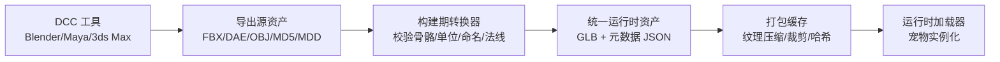
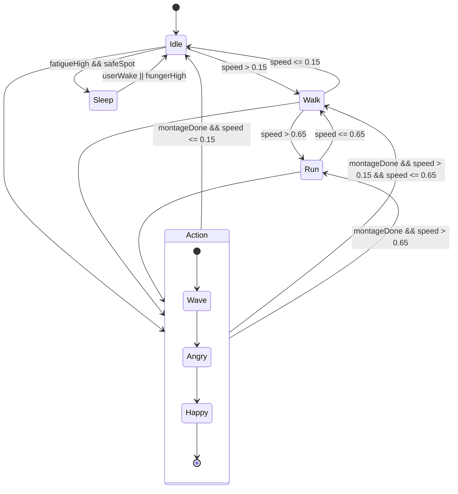
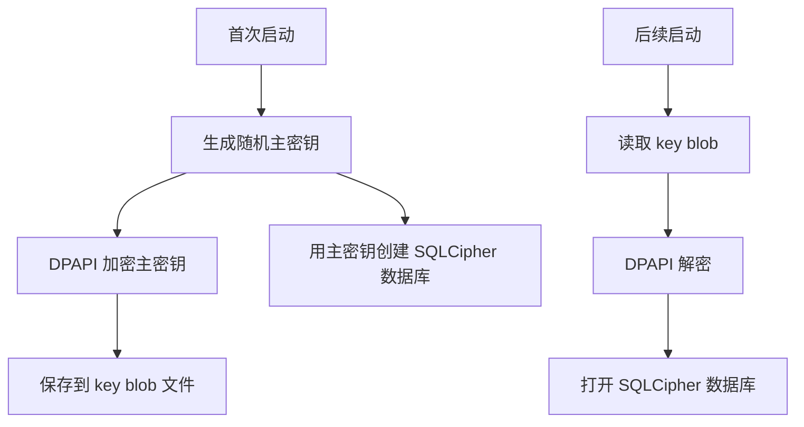
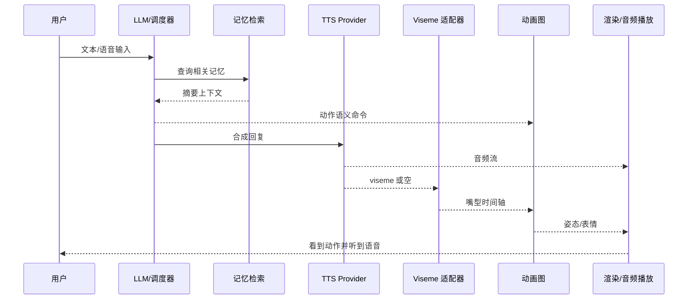
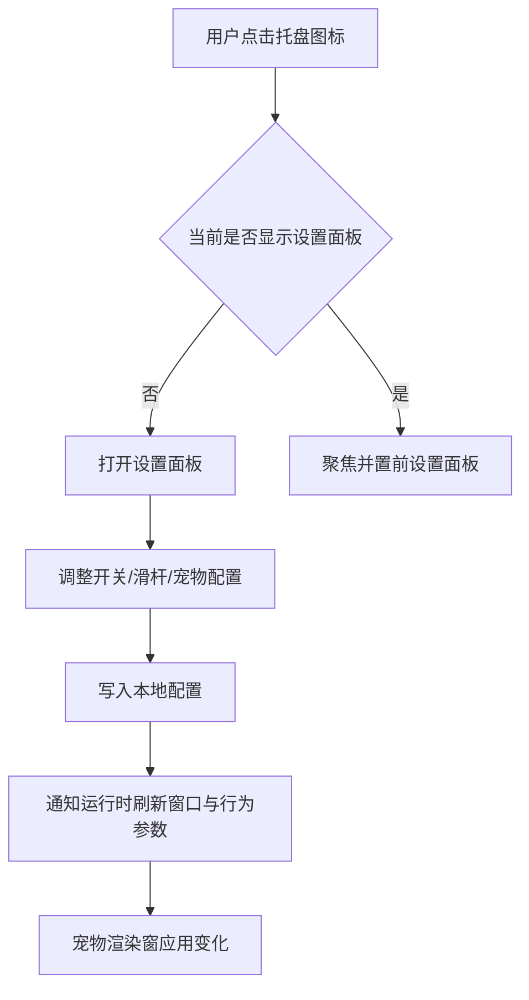
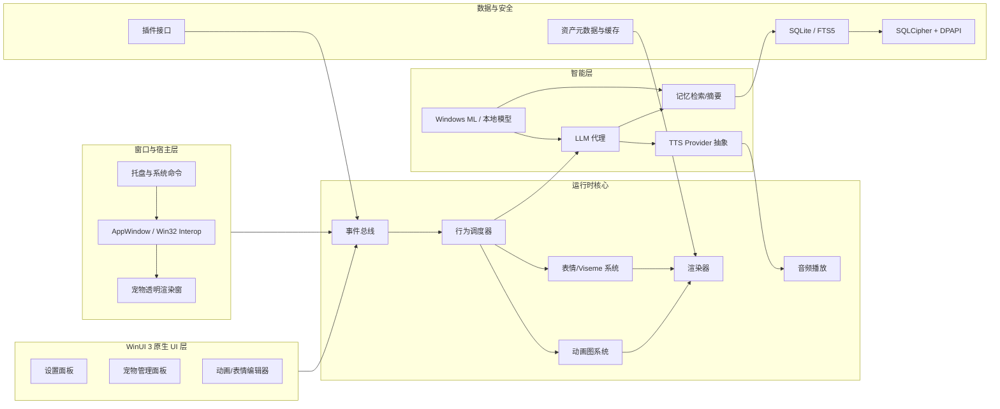
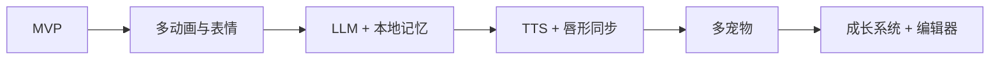

# 开发 Windows 原生 WinUI 3 桌面宠物应用分析报告

## 执行摘要

在“Windows 纯原生 WinUI 3 桌面宠物”这个目标下，最稳妥、可维护、又能兼顾透明悬浮窗、桌面置顶、托盘、3D 角色、动画、语音与 LLM 能力的路线，并不是只靠 XAML 控件把所有事情做完，而是采用 **WinUI 3 负责原生控制面板与应用框架、Win32/WinRT 互操作负责窗口与托盘、独立原生 3D 渲染层负责宠物显示** 的分层方案。Windows App SDK/WinUI 3 适用于 Windows 10 1809 及以上桌面应用；而 AppWindow 与窗口管理能力本身就是建立在 Win32 HWND 模型之上的，因此对“桌宠”这类需要透明、置顶、点击穿透与托盘的应用，**WinUI 3 + Win32 interop** 是自然路线，而不是妥协路线。citeturn29search0turn29search2turn27search1turn27search9turn38search0turn38search1turn38search2

从 3D 资产与动画格式看，**运行时主格式应优先定为 glTF/GLB**。Khronos 将 glTF 定位为面向运行时传输与加载的免版税规范，并明确支持骨骼蒙皮、morph targets、独立 animation clips；GLB 还能把 JSON 与二进制 buffer 打成单文件，避免 base64 膨胀与额外资源请求。相比之下，FBX 依旧是 DCC 工具链最强的交换格式，但其生态和 SDK 更偏“导入/转换”而非轻量运行时交付；OBJ 适合静态网格，不适合作为主动画格式；DAE/COLLADA 很全但 XML 冗长；MD5/MDD 更适合作为兼容性导入或特殊缓存通道，而不建议做主运行时格式。citeturn5search0turn36view0turn37view1turn37view2turn34search11turn35view0turn5search2turn3search10turn3search11

渲染方案上，如果目标是 **先做成、再做强**，建议分成两档。**MVP 档**：C++/WinRT + WinUI 3 + D3D11（或 D3D11 through SwapChainPanel / native child HWND）+ 自定义轻量动画系统；**增强档**：若要更快获得 PBR、glTF 生态、IBL、材质工具链与更成熟的加载器，可考虑接入 **Filament + gltfio**，同时保留 WinUI 3 作为设置面板与宿主壳层。Win2D 适合 2D 特效与编辑器叠层，不适合做 3D 主渲染；DirectML/Windows ML 也不是渲染引擎，它们更适合作为本地 AI 推理层，用于情绪分类、表情触发、检索或本地小模型。值得特别注意的是，微软当前文档已明确提示 **DirectML 进入维护模式，新能力优先向 Windows ML 演进**。citeturn6search2turn30view0turn31view0turn32view0turn10view0turn10view1turn29search1turn29search3turn33search0turn33search2

动画系统应参考 Unreal 的“思路”，而不是照搬引擎。也就是说，要把运行时拆成 **状态机 + Blend Space + 蒙太奇层 + Additive 表情层 + 物理次级骨骼 + Viseme 层**，并且把“可被 LLM 调用”的动作语义暴露成结构化元数据。这样 LLM 不直接操纵骨骼和 clip，而只是下发结构化动作意图；动作编排器再根据优先级、冷却、上下文和当前状态选择 clip、过渡与表情。对桌面宠物而言，**root motion 建议默认关闭或改为“提取后投影到屏幕位移”**，否则会把世界空间动画和桌面屏幕坐标耦合得过紧。Unreal 的官方文档也说明：状态机负责基于逻辑分支切换动画，Blend Space 用输入参数驱动混合，Montage 适合代码驱动的一次性动作，而 Root Motion 适合让动画数据驱动位移。citeturn13search0turn13search1turn14search1turn13search2turn13search17

语音层建议做成 **TTS Provider 抽象**：离线可以接 GPT-SoVITS，在线可以接 OpenAI TTS。OpenAI 的公开文档已经支持流式语音输出，且明确建议对低延迟场景使用 `wav` 或 `pcm`；GPT-SoVITS 官方仓库则提供 Windows 安装方式、零样本与少样本 TTS，并强调少量样本即可拟合声音风格。若要求精确唇形同步，单靠“返回音频”的 TTS 不够，需要额外的 viseme/phoneme 时间轴。作为对照，Azure Speech 官方文档明确支持返回 viseme ID、SVG，甚至 3D blend shapes，因此你的内部接口最好抽象成“**音频流 + viseme 流**”，这样以后无论换成本地对齐器还是云端可回传 viseme 的服务，都不需要重写动画层。citeturn21view0turn21view1turn21view3turn24view0turn23view0

记忆系统方面，桌宠非常适合 **本地优先**。SQLite 作为嵌入式数据库足够轻量、成熟且无需单独服务进程；FTS5 可以承担文本检索；若要数据库文件加密，可以用 SQLCipher，而密钥则用 DPAPI 按当前 Windows 用户保护。这样的组合既符合桌面软件低运维特征，也能尽量避免把长期聊天、语音与偏好数据外发到云端。Windows ML 文档还强调本地 AI 的隐私和离线价值，这与桌宠场景高度一致。citeturn25search7turn25search0turn25search1turn25search2turn33search0

综合推荐如下：**主程序选 C++/WinRT + WinUI 3 + Win32 interop；主运行时资产格式选 GLB；MVP 选 D3D11 自研轻量渲染/动画图；若团队更重视 PBR 与 glTF 工具链，就选 Filament；记忆层选 SQLite + FTS5 + SQLCipher + DPAPI；TTS 做 Provider 抽象，首批接 GPT-SoVITS 与 OpenAI；多宠物先做单进程多实例，后续再引入插件沙盒。** 这是当前 Windows 原生生态里风险最低、扩展性最好的实施路线。citeturn29search0turn29search2turn10view0turn10view1turn31view0turn25search0turn25search1turn25search2turn21view3turn24view0

## 目标与需求边界

本报告采用以下默认边界：目标系统为 **Windows 10/11 x64 桌面环境**；应用基座为 **Windows App SDK + WinUI 3**；考虑普通消费者 PC，包括集成显卡和独立显卡；重点目标不是游戏引擎级大世界，而是 **桌面常驻、低占用、原生交互、可扩展 AI 能力**。WinUI 3 官方文档明确说明其适合构建运行在 Windows 10 1809 及以上的现代桌面应用；Windows App SDK 也强调它将最新 Windows 功能带到 WinUI 3 与 Win32 桌面应用中。citeturn29search0turn29search2

从信息来源优先级看，本报告优先采用以下类别：**官方平台文档**、**格式规范原文**、**官方/原始 GitHub 仓库**、**引擎与算法原始文档**、**微软中文文档**；只有在某些老格式（如 MD5、MDD）缺少现代官方规范时，才回退到较高可信度的历史文档或原工具链说明。这个排序适合你的场景，因为你不是在写论文综述，而是在做一个要长期交付、要过未来升级、还要处理许可证与分发问题的桌面产品。citeturn29search0turn29search2turn5search0turn5search2turn34search11turn7search6

### 必须支持与可选支持项

下表把需求拆成“必须支持”和“可选支持”。其中“必须支持”是为了让 MVP 真正成为一个可用的桌宠，而不是一套技术演示。

| 类别 | 必须支持 | 可选支持 |
|---|---|---|
| 桌面集成 | 常驻托盘、开机自启、置顶、拖拽、缩放、窗口记忆 | 点击穿透切换、贴边吸附、多显示器策略 |
| 渲染 | 单宠物 3D 实时渲染、透明背景、基本阴影/轮廓或伪接地 | PBR、IBL、后处理、粒子、屏幕空间特效 |
| 动画 | idle/walk/run/emote/一次性动作、状态机、过渡、循环 | Blend Space、Additive 层、局部 body mask、程序化摆尾/耳朵 |
| 表情 | 至少一种面部系统（morph 或贴图序列）、情绪映射 | 面骨驱动、程序化眼神、音频驱动 viseme |
| LLM | 结构化动作触发、短期记忆、工具调用边界 | 长期记忆摘要、向量检索、角色成长推理 |
| TTS/语音 | 至少一个离线 TTS 或一个在线 TTS、流式播放抽象层 | 双 provider 热切换、可训练音色、实时对话 |
| 多宠物 | 单进程多实例、宠物管理面板 | 宠物间对话、碰撞互动、群体 AI |
| 数据 | 本地配置、对话记录、动画元数据 | 加密数据库、云同步、插件市场 |
| 编辑能力 | 动画标签编辑、表情映射编辑 | 时间轴编辑、可视化状态机编辑器 |

这份清单背后的核心判断是：桌宠最难的不是“画一个模型”，而是把 **窗口能力、动画能力、AI 能力和常驻桌面体验** 做成一个一致的、低崩溃、低打扰的原生产品。WinUI 3 与 AppWindow 能提供现代桌面外壳；托盘与窗口 Z-order/透明控制则仍需调用 Win32 API，例如 `Shell_NotifyIcon`、`SetWindowPos` 和分层窗口能力。citeturn27search1turn27search0turn38search0turn38search1turn38search2

## 资产格式与内容管线

### 支持格式比较

建议把“支持格式”分成 **运行时主格式** 与 **导入兼容格式** 两层。运行时主格式最好越少越好；导入兼容格式可以多。原因非常现实：运行时如果同时直接承载 FBX、DAE、OBJ+MDD、MD5、GLB，各自的材质、坐标系、骨骼、法线、morph、时间轴、剪辑命名和单位系统都会成为长期维护负担。glTF 本来就是为高效运行时交付设计的，而 FBX、DAE 更像 DCC 交换格式。citeturn5search0turn36view0turn5search2turn34search11

| 格式 | 规范/法律属性 | 骨骼动画 | 蒙皮 | Morph/Shape Keys | 多动画片段 | 文件体积与加载影响 | 主要优点 | 主要缺点 | 结论 |
|---|---|---:|---:|---:|---:|---|---|---|---|
| **glTF `.gltf`** | Khronos 免版税运行时 3D 规范 | 支持 | 支持 | 支持 | 支持 | JSON + 外部 buffer/纹理；资源拆分，适合按需处理；若嵌入 data URI 会增大体积 | 规范现代、PBR 生态好、动画语义清晰 | 多文件管理略麻烦 | **推荐作为导入和运行时主格式之一** citeturn5search0turn36view0 |
| **GLB `.glb`** | glTF 的二进制容器 | 支持 | 支持 | 支持 | 支持 | 单文件；避免 base64 膨胀；打包 JSON + BIN 更利于部署和缓存 | 分发方便、加载路径短、适合桌宠分发 | 不如分离资源那样易于手工编辑 | **最推荐的运行时主格式** citeturn37view1turn37view2 |
| **FBX `.fbx`** | Autodesk 专有格式；SDK 可免费使用但需遵守其条款 | 支持 | 支持 | 支持 | 支持，借助 animation stack/layers | 常见为二进制或 ASCII；解析复杂，通常更适合作构建期转换源 | DCC 支持最广，动画管线成熟 | 规范不够轻量，运行时直读成本高 | **推荐作为导入源，不推荐直接做主运行时格式** citeturn34search11turn34search8turn34search9turn34search12turn34search15turn5search17 |
| **OBJ `.obj`** | 历史公开文档广泛流传，法律归属链条较复杂，通常被视作供应商中立几何交换格式 | 不适合标准动画 | 不适合 | 不适合 | 不适合 | ASCII 文本，静态几何解析简单；但不承载现代动画语义 | 最简单、兼容最广、静态网格好用 | 只适合几何/材质，不适合宠物主动画格式 | **仅作静态附件/碰撞体/原型资产** citeturn35view0 |
| **OBJ + MDD** | 组合方案；MDD 为点缓存生态格式 | 通过点缓存实现，不是骨骼 | 否 | 本质是逐点变形缓存 | 可通过多文件组织 | 顶点逐帧缓存，长片段体积和 IO 压力显著；要求拓扑一致 | 适合布料、面部缓存、烘焙特效 | 不适合常驻低占用桌宠的主动作集 | **仅建议做特殊缓存通道** citeturn3search11 |
| **MD5 `.md5mesh/.md5anim`** | 源自 id Tech 4 的文本格式，偏历史/社区工具链 | 支持 | 支持 | 不支持主流 morph 工作流 | 多动画以分文件方式组织 | ASCII 文本，解析不难，但语义老旧 | 骨骼动画清晰、导入简单 | 材质/PBR/扩展能力弱，生态老旧 | **仅作兼容导入** citeturn3search10turn7search2 |
| **DAE / COLLADA** | Khronos 开放 XML 标准，已形成 ISO/PAS 17506 | 支持 | 支持 | 支持 | 支持 | XML 冗长，文件大、解析慢于 GLB 的工程实践很常见 | 表达能力全、可含动画/物理/运动学 | 互操作不如 glTF 稳定，运行时负担较重 | **导入兼容可保留，不建议做主运行时格式** citeturn5search2 |

上表里最值得强调的判断有两点。第一，**glTF/GLB 是桌宠运行时最合适的主格式**。Khronos 明确把它定义为“高效传输和加载”的免版税规范，规范层已经覆盖了 skin、morph、animations，而 GLB 又把 JSON 与二进制 buffer 封进单文件，非常适合桌面软件的安装、更新、缓存与热加载。第二，**FBX 仍然要支持，但最好只支持到“导入期”**。它的真正价值不在运行时轻量，而在于几乎所有 DCC 工具都能和它打通。citeturn5search0turn36view0turn37view1turn34search11turn34search8turn34search16

### 推荐内容管线

最推荐的内容管线不是“运行时兼容一切”，而是：



这样做的直接好处是：运行时只需要维护一套规范化骨架、一套动画命名规则、一套材质参数映射和一套热加载机制。你甚至可以允许美术继续交付 FBX，但构建系统统一转成 GLB。对于 OBJ、DAE、MD5、MDD 这类兼容输入，也都通过同一个“离线转换器”归一化，而不是把各家解析器直接塞进运行时。Assimp 官方仓库明确支持 40 多种导入格式，正适合承担“导入兼容层”；而 glTF 可以作为最终运行时资产格式。citeturn7search2turn7search6turn5search0turn36view0

更进一步的工程建议是：**把“表情 clip、基础 locomotion clip、一次性动作 montage、viseme 映射、成长阶段差异参数”全部抽成外部元数据**，不要把这些逻辑硬编码在模型文件里。glTF 2.0 规范本身也强调，它只定义动画 keyframe 的存储，不定义运行时如何循环、何时自动播放、如何映射不同时间线，因此桌宠自己的动画编排层必须独立存在。citeturn36view0

## 原生渲染与窗口方案比较

### 方案横向比较

| 方案 | 优点 | 缺点 | 实现复杂度 | 性能 | 样例/依据 | 结论 |
|---|---|---|---|---|---|---|
| **D3D11 + WinUI 3/Win32 interop** | 成熟、资料多、与桌面窗口集成成本低、足够支撑桌宠级 3D | 需要自写导入器/动画图；现代高级特性不如 D3D12 | 中 | 高，且对 1~数个宠物完全够用 | SwapChainPanel/XAML interop、D3D + WinUI/Win32 都有长期文档基础 citeturn38search3turn38search11turn38search19 | **MVP 最推荐** |
| **D3D12 + DirectXTK12 + DirectXMesh** | 原生控制最强、可与 DirectML 共用 D3D12 生态、后续扩展最强 | 开发量大；DirectXTK12 并不直接导入 glTF/FBX；DirectXMesh 主要是几何处理不是动画运行时 | 高 | 最高潜力 | DirectXTK12 仅直接支持 `.CMO/.SDKMESH/.VBO`，DirectXMesh 偏几何处理 citeturn31view0turn32view0 | **适合后续进阶，不是最快 MVP** |
| **Win2D** | 与 XAML 集成轻、2D 特效与编辑器很方便 | 是 2D API；WinUI3 迁移仍在进行中，一些控件支持不完整 | 低 | 对 2D 很好，对 3D 不适用 | Win2D 官方说明它是 GPU 加速 2D API；WinUI3 迁移 still in progress citeturn6search2turn30view0 | **只适合辅助层，不适合 3D 主渲染** |
| **WinUI 3 + SwapChainPanel 原生互操作** | XAML 内嵌渲染面板，能把 DirectX 与 WinUI 组合 | UI 线程约束明显；透明不规则窗与点击穿透仍常要回到 HWND/Win32 | 中 | 高 | `ISwapChainPanelNative::SetSwapChain` 需 UI 线程；SwapChainPanel 是 DirectX 承载面 citeturn38search3turn38search7turn38search11 | **适合嵌入式预览器/编辑器** |
| **Filament + WinUI 3 宿主** | PBR 完整、glTF loader 原生、Windows 支持成熟、上手快于自研完整渲染器 | Windows 后端不是 D3D 而是 OpenGL/Vulkan/WebGPU；和 WinUI 透明桌宠宿主结合需要额外窗口方案 | 中 | 高 | Filament 官方支持 Windows、gltfio、glTF 动画/morph/skin citeturn9view0turn10view0turn10view1 | **如果你重 glTF/PBR，非常值得选** |
| **bgfx + Assimp** | 图形后端灵活，支持 D3D11/12/Vulkan/OpenGL；跨平台潜力大 | 不是“宠物引擎”，动画图、材质语义、导入后整理都要自己补 | 中高 | 高 | bgfx 支持多后端；Assimp 支持 40+ 格式 citeturn11view0turn7search5turn7search6 | **适合想保留未来跨平台的团队** |
| **Windows ML / DirectML** | 本地 AI 推理强，适合情绪、检索、感知与小模型任务 | 不是渲染方案 | 中 | 与模型相关 | Windows ML 是本地 AI 框架；DirectML 为低级 ML 层，且已进入维护模式 citeturn33search0turn33search2turn29search1turn29search3 | **只应作为 AI 层，不应作为渲染方案** |

上表的核心结论是：**不要把“渲染器”“窗口宿主”“导入器”“本地 AI”混成一个概念**。在技术决策里，它们分别属于不同层次。宠物应用最容易失败的地方，就是一开始想同时解决“引擎、编辑器、PBR、AI、跨平台、插件”所有问题，结果 MVP 难产。就你的目标而言，最合理的落地顺序是：**先用 D3D11 或 Filament 跑通一个稳定透明宠物窗，再把动画图、记忆和 TTS 加上去**。citeturn31view0turn10view0turn33search0

### 推荐窗口与渲染宿主策略

桌宠和普通业务桌面软件的最大差别，是它必须处理以下事情：**透明背景、不规则显示区域、桌面置顶、拖拽、可能的点击穿透、托盘、以及与普通设置面板不同的生命周期**。这意味着你最好把窗口分成两类：

第一类是 **宠物渲染窗**。建议使用原生顶层 HWND 或 WinUI 宿主下的专用渲染宿主，并通过 `SetWindowPos` 控制 topmost，通过 `WS_EX_LAYERED` / `SetLayeredWindowAttributes` 组合处理透明，通过必要的 Win32 样式控制点击行为。`SetWindowPos` 文档明确说明它可以修改顶层/弹出/子窗口的大小、位置和 Z 序；`SetLayeredWindowAttributes` 文档明确说明分层窗口由 `WS_EX_LAYERED` 建立。citeturn38search1turn38search2

第二类是 **设置与管理面板**。这一类适合直接使用 WinUI 3 的常规窗口和 AppWindow/OverlappedPresenter 能力。Windows App SDK 官方文档说明，WinUI 3 现在可通过 `Window.AppWindow` 访问 AppWindow 能力；`OverlappedPresenter.IsAlwaysOnTop` 则提供了原生“总在最前”能力；`CreateForToolWindow` 还可创建不出现在任务栏和 ALT+TAB 中的工具窗。对桌宠的设置面板而言，这些能力非常实用。citeturn27search1turn27search0turn27search10

托盘方面，WinUI 3 本身没有等价于经典 WinForms `NotifyIcon` 的核心原生控件，当前最直接、最原生的方式仍然是调用 `Shell_NotifyIcon`。微软官方还提供了 NotificationIcon Sample。对于桌宠这种要长期常驻后台的应用，这比绕路依赖第三方壳封装更符合“纯原生”目标。citeturn38search0turn38search12

### 最终推荐组合

如果你希望 **最短路径做出可交付版本**，我建议：

**路线 A：**
- **C++/WinRT + WinUI 3 + Win32 interop**
- **D3D11 自研轻量渲染器**
- glTF/GLB 运行时
- Assimp/离线转换器负责兼容导入
- Win2D 仅用于 2D 特效与编辑界面预览

这条路线的好处是：完全 Windows 原生，能够精细控制窗口、输入和资源管理，并且不会被外部引擎的宿主模型反向绑架。citeturn29search0turn29search2turn38search1turn38search2

如果你更看重 **PBR 画面质量、glTF 生态和更少的渲染底层工作量**，建议：

**路线 B：**
- **C++/WinRT + WinUI 3 外壳**
- **Filament 作为 3D 渲染层**
- GLB 作为主资产
- 自己写动画编排、表情系统和 LLM 行为层

Filament 官方仓库已经明确给出 Windows 原生 C++ API、`HWND` 级宿主、gltfio loader，以及对 glTF 动画、morph 和 skin 的支持；这意味着它非常适合桌宠这种“角色型 3D 应用”。citeturn10view0turn10view1

## 动画与表情系统

### 动画系统的推荐结构

建议把动画系统拆成六层，而不是只做一个“播放 clip”的小播放器：

1. **Locomotion 层**：管理 idle / walk / run / fly / sit 这类持续状态。  
2. **Action 层**：管理 jump、pounce、wave、sleep_in、eat 等一次性动作。  
3. **Additive 表情层**：在基础动作上叠 moods、breathing、ear twitch、tail sway。  
4. **Face/Viseme 层**：嘴型、眨眼、眼神、怒/乐/困等表情覆盖。  
5. **Physics Secondary Motion 层**：尾巴、耳朵、挂件、裙摆等次级骨骼。  
6. **Constraint/Safety 层**：避免骨骼穿帮、截断超范围角度、在窗口边缘回收位移。

这种分层与 Unreal 的状态机、Blend Space、Montage 思路是一致的。Epic 官方文档对这些对象的定义非常清楚：**State Machine** 用于逻辑分支动画，**Blend Space** 用多个输入值驱动混合，**Montage** 用于代码驱动的一次性动作，**Root Motion** 则可由动画驱动物体位移。桌宠项目不是要复制 Unreal 编辑器，而是吸收其“分层控制”的思想。citeturn13search0turn13search1turn14search1turn13search2

### 建议状态机



对桌宠来说，**idle 并不是“什么都不动”**，而应该是一个可叠加微动作的基态：呼吸、眨眼、眼球轻微扫视、耳尾二级运动、偶发抖动、偶发看向光标。这样角色会“活着”，而不是只在用户说话时才突然动一下。

### Blend Spaces、Montage 与优先级

建议将基础移动做成一维或二维 Blend Space。最小可行版本可以只有一个输入 `speedNorm`：

- `0.0` → Idle
- `0.3` → SlowWalk
- `0.7` → Walk
- `1.0` → Run

桌宠通常不需要 FPS/动作游戏级复杂 locomotion，因此这一级 Blend Space 的目标不是“拟真移动”，而是“减少切换断裂感”。一旦进入 Action 层，就由 Montage 样式的系统接管：例如 `wave_hand`、`eat_snack`、`surprised_backstep`、`jump_to_cursor`。Montage 的优势是它天然适合由代码或 LLM 触发，而且可以做 section、notify、early exit、cooldown。Epic 官方文档也明确指出 Montage 适合用蓝图或 C++ 直接控制播放。citeturn13search1turn14search1turn14search8

推荐优先级从高到低如下：

| 优先级层级 | 示例 | 说明 |
|---|---|---|
| 系统安全层 | hide, stop_voice, freeze, recover_pose | 任何时候都能打断 |
| 强动作层 | jump, panic, greet_user, pickup_item | 一次性动作，通常占用全身 |
| 交互层 | nod, wave, look_at_cursor | 可中断，但优先于 idle |
| Locomotion 层 | idle / walk / run | 基础连续动作 |
| Additive 层 | breathing / blink / tail sway | 永远尽量叠加 |
| Face/Emotion 层 | angry / happy / sleepy | 通常作为局部覆盖层 |

### Root Motion 与桌面坐标

桌面宠物和传统 3D 场景角色最大的不同是：它不是“走在地面上的角色”，而是“在 2D 屏幕平面上移动的角色”。因此 Root Motion 的推荐策略是：

- **默认关闭直接 root motion 驱动**；
- 对需要位移感的动作，提取 root delta；
- 把提取出的位移映射到屏幕坐标；
- 再交由窗口/角色控制器决定是否真正移动。

Epic 官方文档对 Root Motion 的解释非常适合这里：它可以让动画数据驱动位移，动作看起来更贴地、更自然。但对桌宠而言，若直接照搬，会把动画世界坐标与屏幕坐标绑死，造成边界处理、吸附、窗口裁剪、点击热区全都变复杂。所以更推荐“**提取 root delta，作为屏幕位移意图**”。citeturn13search2turn13search17

### 多动画文件组合策略

glTF 2.0 规范强调，动画是以 `animations` 数组存储，且最好把每个动画做成自包含 action。对桌宠来说，这恰好适合做“多文件或多 clip”组合。推荐支持以下两种方式：

**方式一：单模型多 clip**  
一个 `pet.glb` 内含 `Idle`、`Walk`、`Run`、`HappyLoop`、`AngryPose` 等 clip。  
优点是共享 skeleton 和材质最简单。  
缺点是大文件更新粒度差。

**方式二：基础模型 + clip sidecar**  
`pet_base.glb` + `anim_idle.glb` + `anim_walk.glb` + `anim_run.glb` + `face_angry.glb`。  
优点是便于分发与热更新。  
缺点是导入时要做骨架兼容校验。

glTF 官方规范虽然不定义“循环”和“自动播放”等运行时行为，但明确推荐每个动画自包含成 action，这和上面的策略完全一致。citeturn36view0

### 动画元数据结构与伪代码

下面给出一组建议数据结构。重点不是语法，而是 **把动作描述、优先级、body mask、情绪标签、触发条件都外部化**。

```cpp
enum class AnimationLayer : uint8_t {
    Locomotion,
    Action,
    Additive,
    Face,
    Viseme,
    Physics
};

struct ClipRef {
    std::string assetId;        // pet_base.glb / anim_walk.glb
    std::string clipName;       // "Walk"
    float fps = 30.0f;
    bool loop = false;
};

struct BodyMask {
    bool upperBody = true;
    bool lowerBody = true;
    bool face = false;
    bool tail = true;
    bool ears = true;
};

struct AnimationRule {
    std::string semanticId;     // walk/run/idle/angry/happy
    AnimationLayer layer;
    int priority;               // higher wins
    ClipRef clip;
    BodyMask mask;
    float fadeInSec;
    float fadeOutSec;
    float cooldownSec;
    bool allowInterrupt;
    bool extractRootMotion;
    std::vector<std::string> tags;   // locomotion, emotion, user_greeting...
    std::vector<std::string> llmAliases;
};

struct AnimationRequest {
    std::string semanticId;
    float intensity;            // 0~1
    float durationHintSec;      // optional
    std::string reason;         // LLM / system / user gesture / memory recall
    std::map<std::string, float> params;
};
```

```cpp
void UpdateAnimationGraph(float dt)
{
    auto ctx = CollectRuntimeContext();      // speed, mood, hunger, focusTarget, voiceEnergy...
    auto requests = Scheduler::Collect(ctx); // system + behavior tree + LLM + UI

    Pose basePose = EvaluateLocomotionBlendSpace(ctx.speedNorm, dt);

    if (auto action = SelectHighestPriorityAction(requests)) {
        basePose = Blend(basePose,
                         EvaluateClip(action->clip, dt),
                         action->fadeWeight,
                         action->mask);
    }

    basePose = ApplyAdditive(basePose, EvaluateMoodAdditives(ctx), dt);
    basePose = ApplyFace(basePose, FaceController::Evaluate(ctx), dt);
    basePose = ApplyViseme(basePose, VisemeController::Evaluate(ctx.audioTimeline), dt);
    basePose = ApplySecondaryPhysics(basePose, dt); // tail/ears/springs
    basePose = ClampPose(basePose);

    auto screenDelta = ExtractScreenDeltaIfNeeded(basePose, ctx);
    WindowController::ApplyDelta(screenDelta);

    Renderer::SubmitPose(basePose);
}
```

### 表情系统设计

表情层建议同时支持三类技术路径：

| 表情路径 | 技术实现 | 适用场景 | 成本/效果 |
|---|---|---|---|
| 贴图序列/多张图片 | 表情贴图、眼睛/嘴巴 atlas、UV 切换 | Q 版、二次元、低面数角色 | 成本低、风格化强 |
| 骨骼驱动面部 | 面骨、眼球、眉毛、下颌骨 | 更拟人或更立体的角色 | 成本中等，作者要求高 |
| Morph Targets | 面部 shape keys、嘴型、情绪形变 | 标准 3D 角色、唇形同步 | 表达力最高，但资产规范要求高 |

glTF 2.0 规范明确支持 morph targets 与 morph weight 动画；而 Azure Speech 的 viseme 文档则说明，3D blend shapes 可以作为唇形驱动目标。这意味着最稳妥的长期方案是：**内部统一定义一套“面部参数总线”，既能驱动贴图、也能驱动 morph、也能吃 viseme**。citeturn36view0turn23view0

### 表情映射表与 viseme 统一接口

建议把嘴型和情绪统一成参数化接口，而不是写死“某个 TTS 只能控制某个模型”。

```json
{
  "faceBus": {
    "emotion": {
      "joy": 0.0,
      "anger": 0.0,
      "sadness": 0.0,
      "sleepiness": 0.0,
      "surprise": 0.0
    },
    "viseme": {
      "sil": 0.0,
      "A": 0.0,
      "E": 0.0,
      "I": 0.0,
      "O": 0.0,
      "U": 0.0,
      "FV": 0.0,
      "L": 0.0,
      "MBP": 0.0,
      "TH": 0.0
    },
    "micro": {
      "blinkLeft": 0.0,
      "blinkRight": 0.0,
      "browRaise": 0.0,
      "cheekLift": 0.0,
      "jawOpen": 0.0
    }
  }
}
```

如果 TTS provider 能返回 viseme，就直接映射；如果不能返回 viseme，就退化成以下三层之一：  
其一，用 G2P/phoneme 对齐器在本地产生时间轴；其二，用音频能量驱动开合；其三，用更简单的“语句级嘴动模板”。Azure 的官方文档已经给出了 viseme ID、音频 offset、SVG 和 blend shapes 的接口范式，适合作为你内部接口的参考模型。citeturn23view0

### 供 LLM 使用的 JSON Schema

下面给出一个面向 LLM 的动作暴露 Schema。重点是 **LLM 只能选语义动作和强度/持续时间，不直接操纵骨骼**。

```json
{
  "$schema": "https://json-schema.org/draft/2020-12/schema",
  "title": "PetAnimationCommand",
  "type": "object",
  "required": ["commands"],
  "properties": {
    "commands": {
      "type": "array",
      "items": {
        "type": "object",
        "required": ["semantic_id", "intent", "priority_hint"],
        "properties": {
          "semantic_id": {
            "type": "string",
            "description": "语义动作 ID，例如 idle/walk/run/angry/happy"
          },
          "intent": {
            "type": "string",
            "enum": ["locomotion", "emotion", "gesture", "speech_sync", "system"]
          },
          "priority_hint": {
            "type": "integer",
            "minimum": 0,
            "maximum": 100
          },
          "intensity": {
            "type": "number",
            "minimum": 0,
            "maximum": 1
          },
          "duration_hint_sec": {
            "type": "number",
            "minimum": 0
          },
          "target": {
            "type": "string",
            "enum": ["self", "cursor", "user", "other_pet", "screen_edge"]
          },
          "can_interrupt": {
            "type": "boolean"
          },
          "tags": {
            "type": "array",
            "items": { "type": "string" }
          },
          "constraints": {
            "type": "object",
            "properties": {
              "need_voice": { "type": "boolean" },
              "requires_idle_base": { "type": "boolean" },
              "disable_root_motion": { "type": "boolean" }
            },
            "additionalProperties": false
          }
        },
        "additionalProperties": false
      }
    }
  },
  "additionalProperties": false
}
```

### 五个示例条目

```json
[
  {
    "semantic_id": "idle",
    "intent": "locomotion",
    "priority_hint": 10,
    "intensity": 0.2,
    "duration_hint_sec": 8,
    "target": "self",
    "can_interrupt": true,
    "tags": ["baseline", "loop"],
    "constraints": {
      "need_voice": false,
      "requires_idle_base": false,
      "disable_root_motion": true
    },
    "runtime_binding": {
      "asset": "pet_base.glb",
      "clip": "Idle",
      "layer": "Locomotion"
    }
  },
  {
    "semantic_id": "walk",
    "intent": "locomotion",
    "priority_hint": 20,
    "intensity": 0.5,
    "duration_hint_sec": 3,
    "target": "cursor",
    "can_interrupt": true,
    "tags": ["move", "loop"],
    "constraints": {
      "need_voice": false,
      "requires_idle_base": false,
      "disable_root_motion": false
    },
    "runtime_binding": {
      "asset": "anim_walk.glb",
      "clip": "Walk",
      "layer": "Locomotion"
    }
  },
  {
    "semantic_id": "run",
    "intent": "locomotion",
    "priority_hint": 30,
    "intensity": 0.9,
    "duration_hint_sec": 1.5,
    "target": "cursor",
    "can_interrupt": true,
    "tags": ["fast_move", "loop"],
    "constraints": {
      "need_voice": false,
      "requires_idle_base": false,
      "disable_root_motion": false
    },
    "runtime_binding": {
      "asset": "anim_run.glb",
      "clip": "Run",
      "layer": "Locomotion"
    }
  },
  {
    "semantic_id": "angry",
    "intent": "emotion",
    "priority_hint": 60,
    "intensity": 0.8,
    "duration_hint_sec": 2,
    "target": "user",
    "can_interrupt": true,
    "tags": ["emotion", "face", "upper_body"],
    "constraints": {
      "need_voice": false,
      "requires_idle_base": true,
      "disable_root_motion": true
    },
    "runtime_binding": {
      "asset": "face_angry.glb",
      "clip": "AngryPose",
      "layer": "Face",
      "morphs": {
        "browDown": 0.85,
        "eyeSquint": 0.45,
        "mouthFrown": 0.60
      }
    }
  },
  {
    "semantic_id": "happy",
    "intent": "emotion",
    "priority_hint": 50,
    "intensity": 0.9,
    "duration_hint_sec": 4,
    "target": "user",
    "can_interrupt": true,
    "tags": ["emotion", "greeting", "face"],
    "constraints": {
      "need_voice": false,
      "requires_idle_base": true,
      "disable_root_motion": true
    },
    "runtime_binding": {
      "asset": "emote_happy.glb",
      "clip": "HappyLoop",
      "layer": "Face",
      "morphs": {
        "mouthSmile": 0.95,
        "cheekRaise": 0.65,
        "blinkHappy": 0.25
      }
    }
  }
]
```

这五个例子体现的不是“动作文件名怎么写”，而是 **LLM 看到的是语义层，运行时执行的是绑定层**。最终动作选择仍然由调度器做二次裁决，避免 LLM 连发冲突命令。

## 记忆、语音与多宠物智能

### 记忆分层设计

建议把记忆严格分成三层：

| 层级 | 定义 | 存储建议 | 典型内容 | 保留策略 |
|---|---|---|---|---|
| 短期记忆 | 最近一次会话与当前上下文 | 内存 + 会话快照 | 最近对话、当前情绪、屏幕位置、当前动作 | 分钟级到小时级 |
| 长期记忆 | 用户稳定偏好与反复出现事实 | SQLite 表 + FTS5 + 可选 embedding 索引 | 喜欢的称呼、作息、偏好、角色关系 | 天到月 |
| 超长期记忆 | 经摘要压缩后的长期人格材料 | SQLite 摘要表 + 冷数据归档 | 用户画像摘要、习惯、成长事件 | 月到年 |

SQLite 官方说明它是一个小型、快速、嵌入式、无需独立服务进程的数据库，非常适合桌面软件；FTS5 则提供高效全文检索。对桌宠这种“本地优先”的场景，SQLite 比单独拉一个本地服务更合适。citeturn25search7turn25search0turn25search3

此外，如果你希望加入语义检索，可在本地保存 embeddings。OpenAI 的 embeddings 文档强调，向量嵌入适合搜索、聚类与相似度计算；但在桌面宠物里，不一定需要一开始就做大规模向量库。很多情况下，**FTS5 + 摘要 + 少量 embedding** 已经足够。citeturn26search1turn26search10

### 本地加密存储建议

最推荐的本地存储安全组合是：

- **SQLite**：主数据库；
- **SQLCipher**：数据库文件加密；
- **DPAPI / `CryptProtectData`**：保护 SQLCipher 主密钥；
- 可选：把音频缓存与图像缓存拆到单独目录，避免主库膨胀。

SQLCipher 官方仓库明确说明它是 SQLite 的加密分支，支持 256-bit AES 等安全特性；DPAPI 官方文档则说明，用 `CryptProtectData` 保护的数据通常只能由同一登录凭据的用户在同一台机器上解密。这非常适合“当前 Windows 用户下的私人桌宠数据”。citeturn25search1turn25search5turn25search2turn25search6

一个实用的密钥策略如下：



### 检索、摘要与压缩策略

记忆并不应该“越存越多”。更好的策略是：

- 所有原始对话先进入短期记忆；
- 周期性提炼出 long-term candidates；
- 用规则 + LLM 共同决定哪些应写入长期记忆；
- 每周/每月滚动生成超长期摘要；
- 对过时、敏感或低价值条目做淡化、匿名化或删除。

桌宠的关键不是拥有“所有历史”，而是 **在几十毫秒内取回最相关、最温和、最不越界的少量记忆**。因此建议检索时采取三阶段：
- 先用关键词/FTS 召回；
- 再按时间衰减 + 情感相关性 + 最近活跃度重排；
- 最后只把极少量摘要片段喂给 LLM。

### 结构化暴露给 LLM 的记忆与动作元数据

你可以把可供 LLM 使用的上下文统一收敛成：

```json
{
  "pet_runtime_context": {
    "mood": "calm",
    "energy": 0.72,
    "hunger": 0.18,
    "social": 0.66,
    "window_state": {
      "x": 1480,
      "y": 820,
      "scale": 1.1,
      "topmost": true
    },
    "available_semantics": ["idle", "walk", "run", "happy", "angry", "sleep", "wave"],
    "voice_capabilities": {
      "tts_providers": ["local_gpt_sovits", "openai_tts"],
      "viseme_mode": ["none", "energy", "timeline"]
    },
    "memory_slots": {
      "short_term_count": 18,
      "long_term_hits": 3,
      "summary_version": "2026-05"
    }
  }
}
```

这样做的意义在于：**LLM 不直接碰底层模块，而是只看白名单语义与摘要上下文**。这既能提升稳定性，也能避免模型把系统带到未测试路径上。

### TTS 与低延迟语音对话

OpenAI 文档已经明确给出了两件对你很重要的事：  
其一，`gpt-4o-mini-tts` 适合智能实时语音应用；其二，**语音流支持 chunked transfer encoding，可在完整文件出来前播放**；其三，低延迟优先建议使用 `wav` 或 `pcm`。这意味着在线 TTS 完全可以做成边合成边播。citeturn21view0turn21view1turn21view3

GPT-SoVITS 则适合提供离线、本地、可定制音色能力。官方仓库说明它支持零样本 TTS、1 分钟少样本微调，并给出了 Windows 环境的启动方式。对桌宠产品而言，这类本地 TTS 的价值不只在“离线”，还在于你可以把声音人格真正做成本地资产，而不是一个远端接口。citeturn24view0

建议统一 TTS 接口如下：

```cpp
struct AudioChunk {
    std::vector<uint8_t> bytes;
    int sampleRate;
    int channels;
    std::string format; // pcm / wav / opus ...
    int64_t ptsMs;
};

struct VisemeFrame {
    int64_t ptsMs;
    std::string symbol;  // MBP / A / E / O / sil ...
    float weight;
};

class ITtsProvider {
public:
    virtual void StartSynthesis(const std::string& text,
                                const std::string& voiceId,
                                const std::string& styleJson) = 0;
    virtual bool TryReadAudio(AudioChunk& out) = 0;
    virtual bool TryReadViseme(VisemeFrame& out) = 0;
    virtual void Cancel() = 0;
    virtual ~ITtsProvider() = default;
};
```

然后运行时统一走下面的流程：



如果某个 provider 只能输出音频、不能输出 viseme，就让 `TryReadViseme` 返回空；之后由本地对齐器或能量驱动模块补上。这样架构不会被单一供应商锁死。Azure Speech 的 viseme 文档可直接作为你的“有 viseme provider”参考基线。citeturn23view0

### 多宠物与互动系统

多宠物功能建议分成三个阶段来做，而不是一开始上来就做“群聊 AI 社会模拟”。

**第一阶段：单进程多实例**  
一个进程内维护多个 `PetActor`，共享渲染设备、资源缓存、TTS 管理器和记忆服务。这样最省内存，也最好调试。

**第二阶段：规则驱动互动**  
增加宠物间规则，例如：
- 距离近时彼此看对方；
- 一只开心会提升另一只社交值；
- 一只饥饿会抢占喂食资源；
- 冲突情绪会触发安抚动作。

**第三阶段：有限社会行为**  
允许 LLM 在规则框架内生成对话与建议，但不要让它直接控制底层仿真。它最多只能产生“意图”，比如“去找另一只宠物打招呼”，具体路径、拥挤避免、动作选择仍由规则层完成。

推荐的并发模型是：
- UI 线程：WinUI 与命令交互；
- Render thread：每帧渲染；
- Logic thread：AI/行为/成长更新；
- Audio thread：流式解码与播放；
- I/O workers：数据库、网络、模型加载。

成长系统可以很简单，但必须有稳定的数据结构：  
`experience`、`hunger`、`mood`、`cleanliness`、`affinity[user]`、`affinity[otherPet]`。  
这些数值既驱动动画选择，也驱动记忆写入频率和语音语气。

## UI 原型与交互

### 图一 宠物悬浮主窗示意

```text
┌─────────────────────────────────────────────┐
│ 透明区域（无边框、可拖拽、可缩放）           │
│                                             │
│                 /\_/\                       │
│               =( °w° )=   ← 3D 宠物         │
│                 )   (                       │
│                (__ __)                      │
│                                             │
│   [hover 提示气泡]  “我有点想散步了…”         │
│                                             │
└─────────────────────────────────────────────┘
  ↑鼠标穿透可切换     ↑基础热区由宠物包围盒决定
```

这个窗口不是传统意义上的“主窗口”，而更像一个原生桌面角色容器。它需要顶层窗口、Z 序控制、透明背景以及较灵活的命中测试。相关能力主要来自 Win32，而不是单一 XAML 属性。citeturn38search1turn38search2turn27search9

### 图二 托盘菜单示意

```text
┌──────────────────────┐
│ 宠物名字：Mochi      │
├──────────────────────┤
│ 显示/隐藏宠物        │
│ 固定置顶             │
│ 点击穿透             │
│ 跟随鼠标             │
│ 语音开关             │
│ 打开设置             │
│ 宠物管理             │
│ 导入模型/动画        │
│ 退出                 │
└──────────────────────┘
```

托盘是桌宠的真实入口，因为很多时候用户不会保留设置窗常开。Windows Shell 官方提供的 `Shell_NotifyIcon` 与 NotificationIcon Sample 非常适合这类常驻应用。citeturn38search0turn38search12

### 图三 设置面板示意

```text
┌─────────────────────────────────────────────┐
│ 设置                                        │
├───────────────┬─────────────────────────────┤
│ 常规          │ [√] 开机启动                │
│ 外观          │ [√] 始终置顶                │
│ 语音          │ [ ] 点击穿透                │
│ 记忆          │ 缩放:  110%  ─────●──       │
│ 隐私          │ 帧率上限: 30 / 60 / 自动     │
│ 插件          │ 休眠阈值:  5 分钟           │
├───────────────┼─────────────────────────────┤
│               │ [保存] [恢复默认] [导出配置] │
└───────────────┴─────────────────────────────┘
```

WinUI 3 的价值在这里非常明显：设置页、导航、表单、绑定、主题和 Fluent 原生控件都适合用它来做，而不是自己造 UI。citeturn29search0turn29search2

### 图四 宠物管理面板示意

```text
┌──────────────────────────────────────────────────────┐
│ 宠物管理                                             │
├──────────────────────────────────────────────────────┤
│ [Mochi]   模型: pet_cat.glb     状态: 在线   [编辑]  │
│          情绪: 开心 0.72        饥饿: 0.18  [隐藏]  │
│------------------------------------------------------│
│ [Nori]    模型: pet_fox.glb     状态: 休眠   [编辑]  │
│          情绪: 困倦 0.41        饥饿: 0.44  [唤醒]  │
│------------------------------------------------------│
│ [+ 添加宠物]   [导入资产]   [批量设置]   [关闭]     │
└──────────────────────────────────────────────────────┘
```

多宠物不是一定要多进程。对桌宠场景，更推荐先做**单进程多实例**，只在将来确有插件隔离或崩溃隔离需求时，再考虑把部分实例迁成子进程。

### 图五 动画编辑器原型示意

```text
┌────────────────────────────────────────────────────────────┐
│ 动画编辑器                                                 │
├──────────────────────┬─────────────────────────────────────┤
│ Clip 列表            │ 预览窗                              │
│ - Idle               │                                     │
│ - Walk               │             [3D 预览]               │
│ - Run                │                                     │
│ - HappyLoop          │                                     │
│ - AngryPose          │                                     │
├──────────────────────┼─────────────────────────────────────┤
│ Layer                │ 时间轴                              │
│ [Locomotion]         │ Idle ────────────────               │
│ [Action]             │ Run      ───────                    │
│ [Face]               │ Smile        ───────────            │
│ [Viseme]             │ MBP A E O   · · ·                  │
├──────────────────────┴─────────────────────────────────────┤
│ 过渡: 0.18s   冷却: 0.5s   RootMotion: 提取             ▼  │
└────────────────────────────────────────────────────────────┘
```

这类工具不要求一开始就做成 Unity/Unreal 那样复杂，但至少要能“看见 clip、看见过渡、看见标签、看见嘴型时间轴”。

### 图六 表情与 viseme 调试面板示意

```text
┌────────────────────────────────────────────────────────────┐
│ 表情 / Viseme 调试                                         │
├──────────────────────────┬─────────────────────────────────┤
│ 情绪滑杆                 │ 当前嘴型                       │
│ Joy        ───────●──    │ sil  A  E  I  O  U  FV  MBP    │
│ Anger      ──●────────    │          [E=0.74]              │
│ Sleepy     ─────●─────    │                                 │
│ Surprise   ●──────────    │ BlendShapes / Morph Weights    │
│                          │ jawOpen       0.42              │
│ 眨眼频率       0.3 Hz     │ cheekRaise    0.61              │
│ 眼球跟随       [√]        │ mouthSmile    0.08              │
├──────────────────────────┴─────────────────────────────────┤
│ Provider: OpenAI TTS / GPT-SoVITS / Debug Timeline         │
└────────────────────────────────────────────────────────────┘
```

### 图七 动效连拍示意

```text
帧 A                 帧 B                  帧 C                 帧 D
 /\_/\               /\_/\                /\_/\                /\_/\ 
( •w• )      ->     ( •o• )      ->      ( ^w^ )      ->      ( -w- )
 /| |\               /| |\                /| |\                /| |\
 / \ / \             / \ / \              / \ / \              / \ / \
 idle                注意到用户            开心点头             回到基态
```

这类“动效连拍”非常适合设计微交互，例如被唤醒、收到消息、喂食成功、升级成功等。

### 关键交互流程图



### UI 设计重点结论

UI 设计上最重要的不是“看起来像哪个聊天应用”，而是把三个空间分开：  
**桌面宠物空间**、**系统控制空间**、**创作者工具空间**。  
前者应极简、透明、低打扰；中者应原生、耐用；后者则应面向开发/调试。WinUI 3 最适合第二和第三类，而宠物显示窗应更靠近原生渲染与 Win32 窗口控制。citeturn29search0turn27search1turn38search0turn38search1turn38search2

## 架构、里程碑与合规

### 总体架构图



这个架构的关键点在于：**渲染层、动画层、智能层、存储层、UI 层全部解耦**。插件与第三方 Provider 只能通过总线和接口进来，不能随意直接操纵核心对象。

### 推荐第三方库、工具与示例

| 名称 | 角色 | 语言 | 许可证 | 特点 | 活跃度判断 | 推荐度 |
|---|---|---|---|---|---|---|
| **Windows App SDK / WinUI 3** | 原生 UI 与桌面框架 | C++/WinRT / C# | 微软官方平台组件 | 现代原生桌面 UI、窗口、部署能力 | 官方持续维护 | **必选基座** citeturn29search0turn29search2 |
| **DirectXTK12** | D3D12 辅助工具包 | C++ | MIT | 提供资源、效果、模型类，但模型直读仅限 `.CMO/.SDKMESH/.VBO` | 2026 仍有更新 | **D3D12 自研路线推荐** citeturn31view0turn28search2 |
| **DirectXMesh** | 网格内容处理 | C++ | MIT | 法线、切线、缓存优化、meshlet、OBJ 读取工具 | 持续维护 | **离线构建期推荐** citeturn32view0turn6search13 |
| **Filament** | 实时 PBR 渲染器 | C++ | Apache-2.0 | Windows 原生、gltfio、glTF 动画/morph/skin、PBR 完整 | 2026 有稳定发布 | **高画质路线强烈推荐** citeturn9view0turn10view0turn10view1 |
| **bgfx** | 跨后端渲染库 | C/C++ | BSD-2-Clause | 支持 D3D11/12/Vulkan/OpenGL 等多后端，示例多 | 仓库与文档活跃 | **未来跨平台可选** citeturn11view0turn7search5 |
| **Assimp** | 多格式导入器 | C++ | BSD | 40+ 格式导入，适合做离线转换层 | 长期活跃 | **导入兼容推荐** citeturn7search2turn7search6 |
| **Win2D** | 2D GPU 绘制 | C++ / C# | 微软开源许可 | 很适合做 2D UI 特效、编辑器辅助 | WinUI3 迁移仍在进行 | **仅辅助使用** citeturn6search2turn30view0 |
| **GPT-SoVITS** | 本地/离线 TTS | Python | MIT | 零样本/少样本 TTS，Windows 可运行 | 社区非常活跃 | **离线 TTS 推荐** citeturn24view0 |
| **OpenAI TTS** | 在线流式 TTS | 云 API | 服务条款模式 | 支持流式、支持 `wav/pcm` 低延迟输出 | 官方维护 | **在线 TTS 推荐** citeturn21view0turn21view1turn21view3 |
| **SQLite + FTS5** | 本地记忆数据库 | C | Public Domain | 嵌入式、零运维、检索能力足够 | 极成熟 | **强烈推荐** citeturn25search7turn25search0 |
| **SQLCipher** | SQLite 加密 | C | BSD 风格/商业条款并存 | 数据库文件加密 | 长期维护 | **敏感数据推荐** citeturn25search1turn25search5 |

如果你还需要示例代码入口，最值得先读的并不是散落在博客里的二次封装，而是：
- **Windows App SDK Samples**，用于看 WinUI 3 官方能力用法；citeturn28search9
- **DirectXTK12 Model Viewer**，用于理解微软自带模型工具链思路；citeturn28search2
- **Filament 官方仓库与 gltfio**，用于评估一体化 glTF 路线；citeturn9view0turn10view1
- **bgfx examples**，用于理解多后端渲染宿主方式；citeturn7search5
- **NotificationIcon Sample**，用于系统托盘；citeturn38search12

### 开发计划与里程碑

下表工作量以“**单个熟悉 Windows 原生开发的工程师人日**”估算；若团队包含图形、客户端、AI、工具各 1 人，实际并行时间可大幅缩短。以下工期是工程估算，不是官方数据。

| 阶段 | 可交付物 | 估算人日 | 关键风险 |
|---|---|---:|---|
| MVP 核心 | 托盘、透明宠物窗、单宠物渲染、idle 动画、设置面板、本地配置 | 20~30 | 透明窗与渲染宿主耦合、输入命中区处理 |
| 动画系统增强 | walk/run/idle 状态机、过渡、表情层、动画元数据、热加载 | 15~25 | 资产规范不统一、过渡抖动、姿态穿帮 |
| 多格式导入 | FBX/OBJ/DAE 导入到 GLB 管线、离线校验器 | 10~18 | 坐标系/单位/骨架兼容问题 |
| LLM/记忆 | 短期/长期记忆、SQLite/FTS、摘要压缩、结构化动作触发 | 15~22 | 记忆污染、工具调用越界、提示词漂移 |
| TTS 与嘴型 | GPT-SoVITS、本地播放、OpenAI 流式 TTS、基础 viseme/能量嘴型 | 12~20 | 吞音、音画不同步、provider 抽象不合理 |
| 多宠物 | 多实例管理、事件总线、宠物管理面板、共享资源缓存 | 12~18 | CPU/GPU 占用上升、调度冲突 |
| 成长与互动 | 经验/饥饿/情绪/社交、宠物间规则互动 | 10~15 | 状态爆炸、可解释性下降 |
| 工具化与发布 | 动画编辑器、表情调试器、日志/诊断、MSIX/安装发布 | 15~25 | 资源路径、版本升级、用户数据迁移 |

如果只看“最小可交付版本”，我建议你把版本路线收敛为：



### 安全、隐私与合规注意事项

首先，**本地优先** 是桌宠产品最重要的安全设计原则。Windows ML 官方文档强调本地 AI 的隐私与离线价值；SQLite/SQLCipher/DPAPI 这套方案则能把对话、偏好、语音缓存尽量留在用户机器上。只有在用户显式开启云端功能时，才应该上传文本或音频。citeturn33search0turn25search1turn25search2

其次，**云服务权限要细粒度**。建议把“是否允许上传语音”“是否允许上传聊天历史供长期记忆增强”“是否允许云端总结记忆”拆成三个独立开关，而不是一个大而全的“启用 AI”。这不是某个文档要求，而是桌面陪伴类产品避免用户反感的实践底线。

再次，**许可证不能最后再看**。你至少要注意四类许可边界：

- **格式/SDK 许可边界**：FBX 是 Autodesk 生态格式，SDK 使用和分发要读其条款；glTF/COLLADA 更开放。citeturn34search11turn5search0turn5search2
- **开源组件许可**：Filament Apache-2.0，bgfx BSD-2-Clause，Assimp BSD，DirectXTK/DirectXMesh MIT，GPT-SoVITS MIT，SQLCipher 社区版为 BSD 风格许可。citeturn10view1turn11view0turn7search6turn31view0turn32view0turn24view0turn25search5
- **资产版权**：模型、动画、贴图、语音样本、角色设定文件都可能受版权或商用条款约束。
- **声音克隆合规**：如果允许用户训练或导入他人声线，必须有明确授权提示与本地安全告警。

最后，**恢复与可删除性** 要从第一版就有。用户应能一键：
- 清空记忆；
- 清空语音缓存；
- 导出/删除配置；
- 禁用所有云端 provider；
- 删除某只宠物的全部数据。  

桌宠是“陪伴型常驻软件”，不是一次性的演示程序。它越常驻，越需要把隐私控制做得像系统设置，而不是像实验功能。

### 最终推荐方案

如果你希望在 Windows 原生生态中，以较低风险做出一个 3D、可说话、可记忆、可成长、后续还能扩展多宠物的桌面宠物，最推荐的组合是：

- **语言/框架**：C++/WinRT + Windows App SDK + WinUI 3  
- **窗口**：宠物窗走 Win32/WinUI interop，设置窗走标准 WinUI 3  
- **渲染**：MVP 用 D3D11，自研轻量图；若追求更快得到成熟 PBR 与 glTF 生态，则用 Filament  
- **资产**：运行时统一为 GLB；FBX/OBJ/DAE/MD5/MDD 只作导入兼容  
- **动画**：状态机 + Blend Space + Montage + Additive + Viseme  
- **记忆**：SQLite + FTS5；敏感数据用 SQLCipher + DPAPI  
- **语音**：TTS Provider 抽象，首批接 GPT-SoVITS 与 OpenAI TTS  
- **AI**：LLM 只看结构化上下文和白名单语义动作，不直接控制底层骨骼/窗口  
- **多宠物**：先单进程多实例，再决定是否引入子进程隔离  

这套方案的最大优点，不是某一个点“最先进”，而是 **每一层都能替换、都能调试、都能渐进演进**。对于原生桌面宠物这类会长期生长的产品，这比短期内堆最多技术名词更重要。citeturn29search0turn29search2turn31view0turn10view0turn5search0turn25search0turn25search1turn25search2turn21view3turn24view0